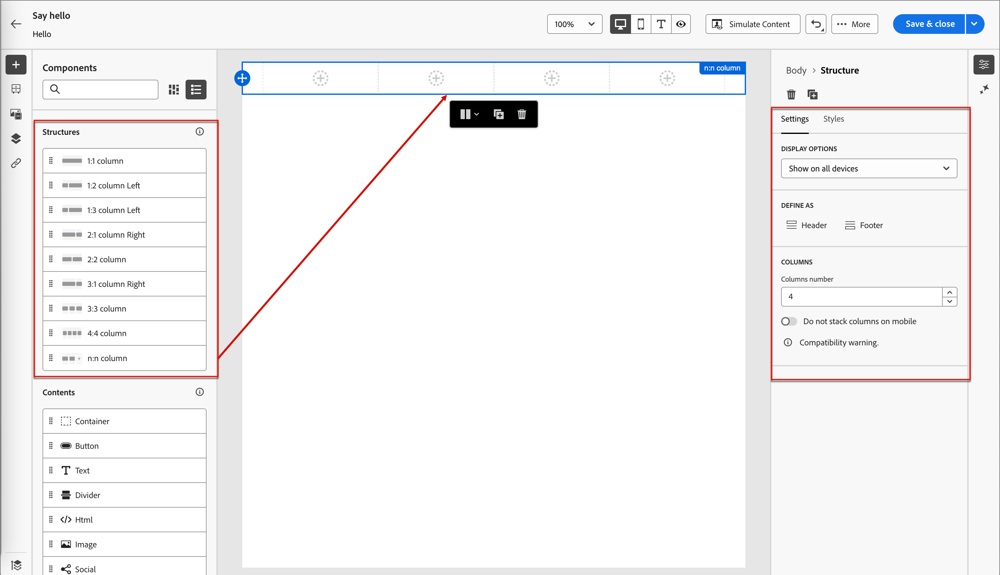

# Content authoring - components (Prime)

1. To start your content design, drag an item from the **[!UICONTROL Structures]** and drop it onto the canvas.

   Add as many items from _[!UICONTROL Structures]_ as you need and edit the settings for each in the pane on the right.

   >[!TIP]
   >
   >Select the _[!UICONTROL n:n column]_ component to define the number of columns of your choice (between three and 10). You can also define the width of each column by moving the arrows below the column.

   {width="800" zoomable="yes"}

   Each column size cannot be less than 10% of the total width of the structure component. Only empty columns can be removed.

   For more information about using and formatting these components, see [Structure components](../main-guide/content/structure-components.md).

1. Expand the **[!UICONTROL Contents]** section and add as many content components as you need into one or more structure components.

   {width="800" zoomable="yes"}

   * [Container](../main-guide/content/content-components.md#container)
   * [Button](../main-guide/content/content-components.md#button)
   * [Text](../main-guide/content/content-components.md#text)
   * [Divider](../main-guide/content/content-components.md#divider)
   * [Image](../main-guide/content/content-components.md#image)
   * [Social](../main-guide/content/content-components.md#social)
   * [Form](../main-guide/content/content-components.md#form) (landing pages only)

1. If needed, you can make additional customizations for each component in the _[!UICONTROL Settings]_ or _[!UICONTROL Style]_ tabs.

   For example, you can change the text style, padding, or margin of each component.

1. To add conditional content and adapt the content to the targeted profiles based on conditional rules, select a content component and click the **[!UICONTROL Enable conditional content]** icon in the component toolbar.

   For more information, see [Conditional content](../main-guide/content/conditional-content.md).
