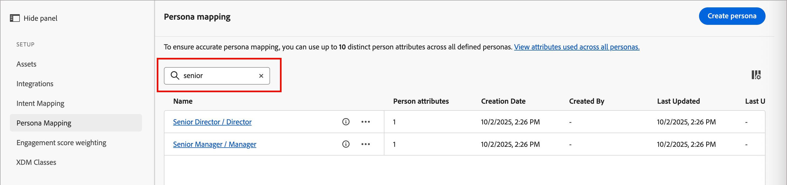
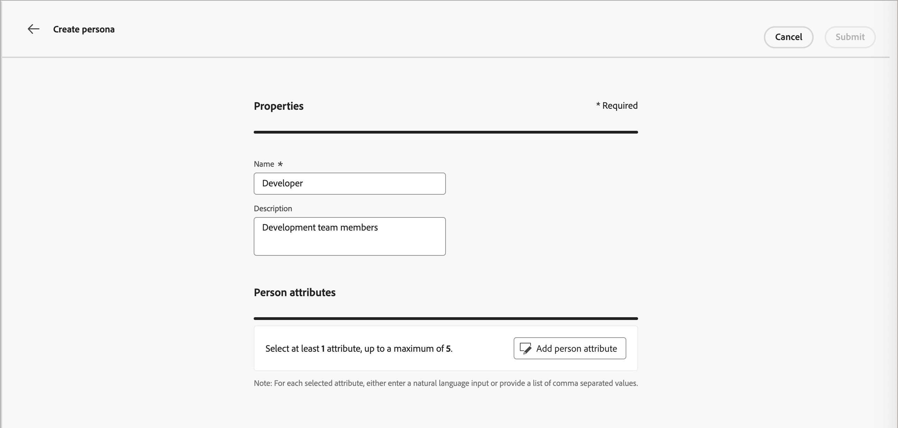
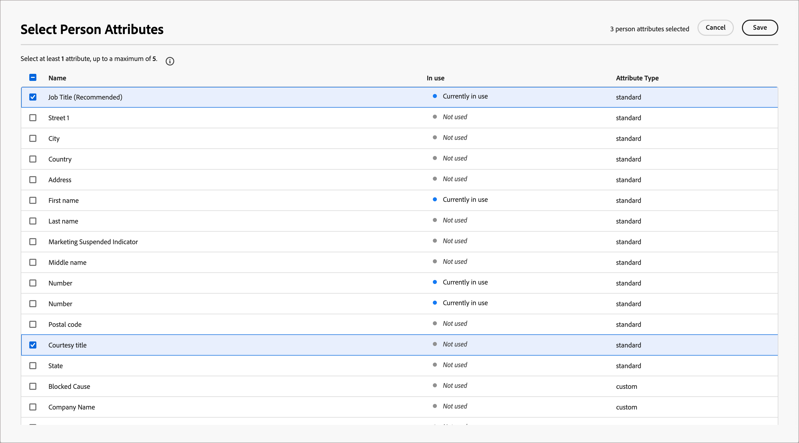

# Persona mapping

<!-- not available until GA -->

Personas are a key aspect in an account-based marketing (ABM) approach because they help marketers adjust their strategies to the specific needs, preferences, and pain points of individuals within target accounts. Marketers can create detailed profiles for each persona, including their background, responsibilities, pain points, and preferred communication channels. With these definitions, administrators can configure personas according to person attributes in Marketo Optimizer so that people lists and person journeys can use streamlined and consistent filtering that captures these personas.

In Marketo Optimizer, persona mapping provides an additional capability beyond role template conditions: you can filter [people lists](../audiences/people-lists.md) and [person journeys](../marketing/person-journeys.md) using **[!UICONTROL Derived Persona]** as a filter criterion. A _derived persona_ is the persona that the system infers for a person record by evaluating their attributes against all configured persona definitions.

Persona definition and usage limitations:

* You can have up to 20 personas defined in the _[!UICONTROL Persona mapping]_ list.
* Each persona can include up to five attributes in its definition.
* Across all defined personas, you can use up to ten different person attributes.

>[!BEGINSHADEBOX]

**Use case: job title variations**

Many marketing and sales teams use job titles as a way to identify different personas within an account. But titles for contacts can be inconsistent and use numerous variations for similar roles. When building people list filters or person journey audience conditions, it can require that you define every possible related job title for a given role. You can simplify these definitions and bring people with similar job titles under one inferred persona, which you can then target by filtering on _Derived Persona is Product Management_ instead of matching individual job title values.

>[!ENDSHADEBOX]

## Access the configured personas {#access}

1. In the left navigation, choose **[!UICONTROL Administration]** > **[!UICONTROL Configurations]**.

1. Click **[!UICONTROL Persona mapping]** on the intermediate panel to display the list of personas.

   {width="800" zoomable="yes"}

   From this page, you can [create](#create-a-persona), [edit](#edit-a-persona), or [delete](#delete-a-persona) personas.

   The Persona mapping list is organized as a table and displays the most recently updated personas at the top (sorted by _[!UICONTROL Last update]_). You can customize the displayed table by clicking the _Column settings_ (  ) icon in the top-right corner and selecting or clearing the column checkboxes.

   {width="300"}

1. To access the details for a persona, click the name.

### Default personas

The _Persona mapping_ list includes five default personas that are defined according to the job title attribute. You can edit any of these default personas according to the needs of your organization:

| Persona | Job titles |
| ------- | ---------- |
| CXO / EVP – CXO / Executive Vice President | CEO, CIO, CTO, CMO, CFO, Executive Vice President of Strategy |
| SVP / VP – Senior Vice President / Vice President | SVP of Marketing, VP of Sales, SVP of Operations, VP of Product, VP of IT |
| Senior Director / Director – Senior Director / Director | Director of Engineering, Senior Director of Product, Director of Finance, Director of Customer Success |
| Senior Manager / Manager – Senior Manager / Manager | Senior Marketing Manager, IT Manager, Operations Manager, Sales Manager, HR Manager |
| Individual Contributor – Individual Contributor | Account Executive, Software Engineer, Marketing Specialist, Customer Success Representative |
| Analyst – Analyst | Business Analyst, Data Analyst, Market Research Analyst, Financial Analyst, Operations Analyst |
| Developer – Developer | Front-End Developer, Back-End Developer, Full-Stack Developer, Mobile App Developer, DevOps Engineer |
| Professional Staff – Professional Staff | HR Specialist, Legal Counsel, Compliance Officer, Project Manager, Procurement Specialist |
| Consultant – Consultant | Management Consultant, IT Consultant, Business Process Consultant, Marketing Consultant |
| Other – Other | Industry Specialist, Independent Advisor, Freelance Consultant, Subject Matter Expert |

### List filtering

To locate the persona that you want, enter a text string into the search bar to match personas by name.

{width="700" zoomable="yes"}

## Create a persona {#create-a-persona}

1. In the left navigation, choose **[!UICONTROL Administration]** > **[!UICONTROL Configuration]**.

1. Click **[!UICONTROL Persona mapping]** in the intermediate panel.

1. Click **[!UICONTROL Create persona]**.

1. Enter a unique **[!UICONTROL Name]** and **[!UICONTROL Description]** (optional) for the persona.

   {width="700" zoomable="yes"}

1. Select the attributes to use for matching the persona.

   * Click **[!UICONTROL Select person attributes]**.

   * In the dialog, select the checkbox for each attribute that you want to map (a maximum of five).

      You can customize the displayed table by clicking the _Column settings_ (  ) icon in the top-right corner.

      To filter the attribute list by name, enter a text string into the search bar. You can also click the _Filter_ (  ) icon at the top left to filter the displayed list by type, _Standard_ or _Custom_.

      {width="700" zoomable="yes"}

   * Click **[!UICONTROL Save]**.

     The selected attributes are populated in the _[!UICONTROL Persona attributes]_ section.

1. For each attribute, enter the comma-separated values that you want to match for the attribute.

1. Click **[!UICONTROL Submit]**.

## Edit a persona {#edit-a-persona}

Click the persona name to access and edit the details for the persona.

You can change the name or description, add attributes, or update the attribute values. Click **[!UICONTROL Submit]** when your changes are complete.

## Delete a persona {#delete-a-persona}

Deleting a persona removes it from the _Persona mapping_ list and it is no longer available as a derived persona filter in people lists or person journeys.

1. On the _[!UICONTROL Persona mapping]_ page, locate the persona that you want to delete.

1. Next to the name, click the ellipses (**...**) icon and choose **[!UICONTROL Delete]**.

1. In the confirmation dialog, click **[!UICONTROL Delete]**.

## Filter by Derived Persona {#derived-persona-filter}

After personas are configured, Marketo Optimizer derives a persona for each person record by evaluating the record's attributes against the defined persona mappings. You can use the inferred result — the _Derived Persona_ — as a filter when defining the audience for a people list or a person journey.

The Derived Persona filter appears in the filter panel under the **[!UICONTROL Special filters]** category alongside other inferred attributes such as journey membership.

### People lists

When you add or remove members from a static people list, or when you define the membership rules for a dynamic people list, you can filter by Derived Persona to target all people whose attributes match a specific configured persona.

**Static list — Add members**

1. Open the static list and click **[!UICONTROL Add people]** at the top right.

1. In the filter dialog, expand **[!UICONTROL Special filters]** and drag **[!UICONTROL Derived Persona]** onto the canvas.

1. In the filter condition, choose **[!UICONTROL is]** and select one or more personas from the list.

1. Click **[!UICONTROL Done]** to apply the filter and qualify matching people into the list.

**Dynamic list — Set membership rules**

1. Open the dynamic list and select the **[!UICONTROL Rules]** tab.

1. Click **[!UICONTROL Edit rules]**.

1. In the filter dialog, expand **[!UICONTROL Special filters]** and drag **[!UICONTROL Derived Persona]** onto the canvas.

1. In the filter condition, choose **[!UICONTROL is]** and select one or more personas from the list.

1. Click **[!UICONTROL Done]** to save the rule.

   Membership is updated automatically as person records are evaluated against the rule.

### Person journeys

When you configure the audience for a person journey using an event audience, you can use Derived Persona as a person profile filter to control which people enter the journey.

1. Click the **[!UICONTROL Person audience]** node in the journey canvas.

1. In the node properties panel, select **[!UICONTROL Event audience]** as the audience type.

1. Under **[!UICONTROL Person profile filters]**, click **[!UICONTROL Add filter]**.

1. Expand **[!UICONTROL Special filters]** and drag **[!UICONTROL Derived Persona]** onto the filter canvas.

1. In the filter condition, choose **[!UICONTROL is]** and select one or more personas from the list.

   Only people whose derived persona matches the selected values are eligible to enter the journey.
