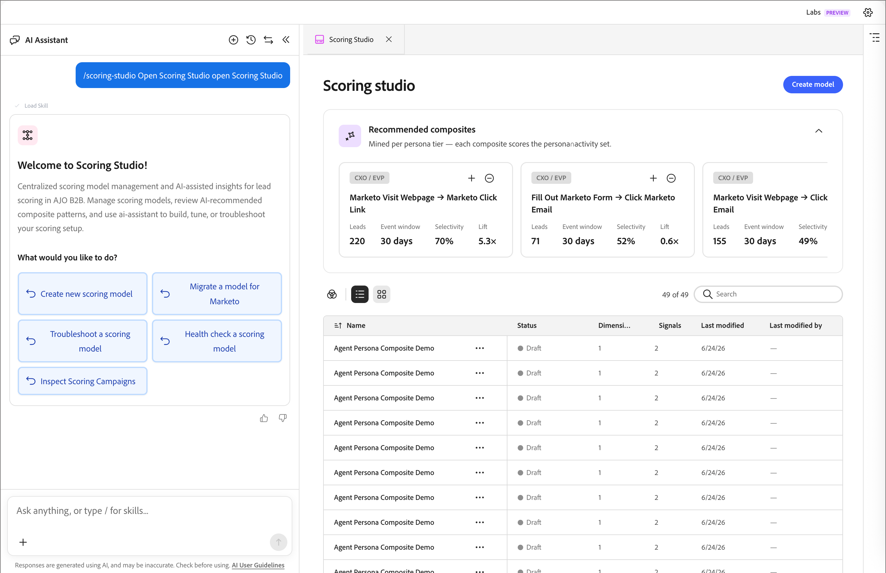

# Create custom scoring models

>[!CONTEXTUALHELP]
>id="ajo-b2b-prime_scoring_studio"
>title="Scoring Studio"
>abstract="Use the Scoring Studio skill to create, configure, and publish custom lead scoring models through the AI Assistant chat interface."

The [_Scoring Studio_ skill](./skills.md#scoring-signals) in [!DNL Adobe Marketo Optimizer] provides an AI-native lead scoring solution that enables you to create, configure, and publish lead scoring models. The studio combines an agent-driven workflow with a visual UI — you can build scoring models through natural language prompts in the [AI Assistant chat interface](./chat-interface.md) or by interacting directly with the UI controls.

* **Skill** - `scoring-studio`
* **Invocation** - Use a slash command to open Scoring Studio. For example: _"open Scoring Studio."_
* **Reads from / writes to** - [!DNL Marketo Optimizer] scoring service; reads [!DNL Marketo Engage] lead fields and activity types

On launch, AI Assistant automatically fetches relevant context — including activity types, lead fields, person lists, and existing score lists — to ground its suggestions in your data.

{width="700" zoomable="yes"}

## Create a scoring model {#create-model}

When you open Scoring Studio, AI Assistant proposes a relevant example scoring model pre-populated with a static list and a set of scored activities. You can accept this suggested starting point or provide your own prompt to define a custom model.

### Preview the model {#preview-model}

After you provide a prompt, AI Assistant generates a model preview before making any changes. The preview surfaces:

* Scoring dimensions in use
* Attributes and activities being scored
* Static lists or smart lists applied as segments
* A summary of the model goal, target segment, and primary signals

You can review the preview and choose to create the model based on it, or continue refining through the chat before finalizing.

### Model structure {#model-structure}

The created model is organized into _dimensions_ and _signals_. You can configure each signal using the property panel in the UI:

* **Signal type** — Activity-based or attribute-based
* **Activity or attribute** — The specific item to score
* **Signal parameters** — Adjustable settings for the signal

You can build and configure models entirely through AI Assistant using natural language, or interact directly with the UI controls.

## Publish a scoring model {#publish-model}

When your model is finalized, instruct AI Assistant to publish it. The publish process handles the following automatically:

| Step | What happens |
|---|---|
| **Rule compilation** | All scoring rules are compiled and validated |
| **Score task creation** | A scheduled score task is created and configured to run daily |

After publishing, you also have the option to trigger a manual run to process scores immediately.

## View scoring results {#view-results}

When a scoring run completes, scores are written back to [!DNL Marketo Engage] via the lead import process. After the import completes, updated scores can be verified directly in [!DNL Marketo Engage].

After each run, you can view a results summary that shows:

* How many people were scored
* The individual score changes per person

An audit log is available for reviewing additional run details.
