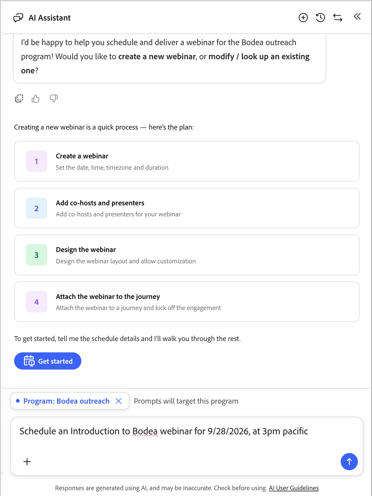

# Create and promote webinars

The [chat interface](./chat-interface.md) can take a webinar from creation through promotion, delivery, post-webinar nurture, and reporting — entirely through the conversation pane. Everything the chat interface builds uses the same webinar asset, journeys, and tokens described in [Interactive webinars overview](../marketing/webinars-overview.md), so you can move between chat and the design interface at any point.

## Entry points

From the "Welcome to marketing management" greeting, select the **[!UICONTROL Webinar]** category chip to see suggested prompts, including:

* *"Schedule and Deliver a Webinar"*
* *"Show me all my upcoming webinars"*
* *"Give the details of the webinar [webinar name]"*

{width="700" zoomable="yes"}

When you open the chat pane from inside a program, it scopes prompts to that program automatically.

## Add a scheduled webinar {#add-webinar}

Describe the webinar you want in a single message, for example:

*"Create an interactive webinar called 'Cybersecurity 101: Protecting Your Data From Modern Threats' on October 12, 2026 at 4pm America/Los_Angeles for [program]."*

1. The chat pane shows a **Task Plan** checklist and works through it: resolve the program, set the name, start time, end time, time zone, and capacity, then confirm.

   {width="500" zoomable="yes"}

1. The chat pane lists your available webinar **licenses** (for example, a high-capacity add-on with its capacity value) and asks which one to use. Reply with the capacity you want, for example *"Use webinar capacity at 1000."*

   {width="500" zoomable="yes"}

1. The chat pane echoes back the program, name, start time, time zone, duration, and capacity, and asks you to **confirm** before it creates the webinar.

1. After creating the webinar, the chat interface displays a **webinar card** with the start and end time, duration, host, capacity, provider (Adobe Connect), a setup URL, a launch URL, an engagement dashboard link, and creation metadata. 

1. The chat interface then offers **next-best actions**: _Design your webinar_, _Add a co-host_, _Add a presenter_, _Set up promotional journeys_, and _Set up post-webinar nurture journey_.

   {width="500" zoomable="yes"}  

### Add co-hosts and presenters {#co-hosts-presenters}

Select **[!UICONTROL Add a co-host]** or **[!UICONTROL Add a presenter]** from the next-best actions, or ask directly, for example *"Add a co-host [first name] [last name] [email]."* The chat interface opens the same add dialog used in the designer — enter a name and email, since everyone is currently added the same way rather than selected from a roster picker. A confirmation appears once the person is added.

{width="500" zoomable="yes"} 

### Design the webinar

Select **[!UICONTROL Design your webinar]** to open the webinar setup page, where you configure content, layout, and registration settings in the embedded [!DNL Adobe Connect] design surface. Complete any design changes in that interface; the chat interface links you there rather than designing the room in chat. See [Design the webinar](../marketing/create-webinar.md#create-and-design-a-webinar).

{width="500" zoomable="yes"} 

## Create a promotion journey

1. Ask the chat interface to set up a promotional journey.

   It asks you to choose a template and name the journey, for example *"Invite/Registration journey."*

1. The chat interface creates the journey and links emails to its nodes, building an invitation-and-reminder flow with webinar member status updates.

1. The chat interface lists what is left to configure in the journey canvas.

1. Click **[!UICONTROL Edit journey nodes]** and respond to inquiries about what you need to complete the journey.

    You can upload a campaign document to supply details, or continue with the chat to identify what is needed.
    
    Or, you can work directly in the journey canvas to address each node:

    * Select the first journey node and set the journey audience. [Learn more](../marketing/person-audience-node.md)
    * Select the invitation _Send email_ node and click **[!UICONTROL Edit email]**. [Learn more](../marketing/email-channel.md)
    * Select the Listen for an event node and  click **[!UICONTROL Edit event]**. Set the event filter for the registration form on the _Fills Out Form_ event. [Learn more](../marketing/listen-for-event-nodes.md#event-filters)
    * Verify the **[!UICONTROL Change webinar member status]** fields on each status-change node. [Learn more](../marketing/action-nodes.md#actions-and-constraints)

1. Finish configuring the other nodes and address 

1. When complete, click **[!UICONTROL Publish now]** to make the journey live and begin the promotion.

## Create a post-webinar journey

1. Ask the chat interface for a post-webinar journey.

   It prompts you for a template and name.
   
1. The chat interface creates a **Split Path** node with defined paths and actions:

   * An **_Attended_** branch (for example, a reply and resources _Send email_ node)
   * A **_No-Show_** branch (for example, a "missed it? re-watch" _Send email_ node)
   
   And each is followed by a _Wait_ and a follow-up _Send email_ node.

   The split condition is set to identify the webinar state, using _Has attended webinar_. 

1. Click **[!UICONTROL Edit journey nodes]** and respond to inquiries about what you need to complete the journey.

    You can upload a campaign document to supply details, or continue with the chat to identify what is needed.
    
    Or, you can work directly in the journey canvas to address each node.
     
1. Finish configuring the other nodes and address 

1. When complete, click **[!UICONTROL Publish now]** to make the journey live and begin the followup.

## Check reporting

In the chat interface, you can ask reporting questions like *"Show me all my upcoming webinars"* or *"Give the details of the webinar [name]"*. It surfaces the engagement dashboard link along with next-best actions such as **Design**, **Add co-host**, or **Publish on webinar date**.

For deeper analytics — attendance, poll and survey performance, and per-member data — the chat interface links out to the webinar's **Analytics** and **Members** tabs, and to the cross-program roll-up in **Webinar management**. <!-- See [Webinar reporting](https://experienceleague.adobe.com/en/docs/journey-optimizer-b2b/prime/marketing-management/webinars/webinar-reporting). -->
