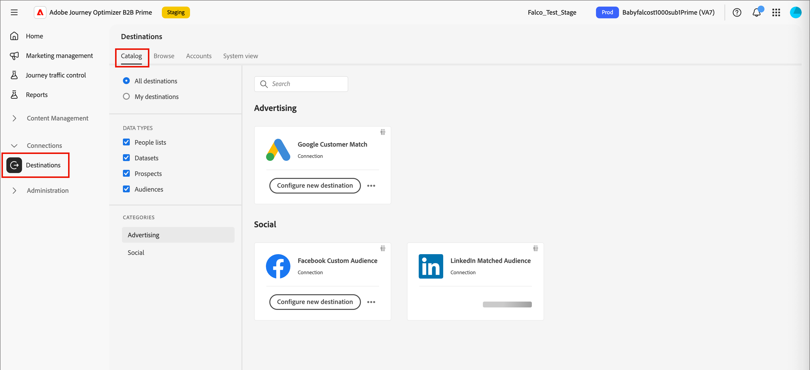

# Destinations

Destinations are pre-built integrations that let you send [static people lists](./people-lists.md#static-lists) from [!DNL Marketo Optimizer] to external advertising or social platforms, such as a LinkedIn campaign audience, a Google Customer Match audience, or a Facebook Custom Audience. Activating a static list to a destination keeps membership in sync: as people are added to or removed from the list, they are correspondingly added to or removed from the destination audience and, by extension, from any campaign that the audience feeds.

There are two ways to activate people to a connected destination:

* **From a static list** — Activate an existing static list directly from the **_[!UICONTROL People lists]_** tab. See [Activate to a destination](./people-lists.md#static-list-activate).
* **From a person journey** — Add an **_[!UICONTROL Activate to destination]_** action to a journey path so that anyone who reaches that node is added to a list and sent to the destination. See [_Add an action node_](../marketing/action-nodes.md#add-an-action-node).

>[!BEGINSHADEBOX]

## Required permissions {#required-permissions}

Full destination capability requires the following [!DNL Adobe Experience Platform] permissions to be enabled.

| Category | Permission | Required |
|--- |--- |--- |
| Sandboxes | Sandbox access _(enabled by default)_ | Yes |
| Dashboards | View Standard Dashboards | Yes |
| Dashboards | Manage Standard Dashboards | Yes |
| Destinations | View Destinations | Yes |
| Destinations | Manage Destinations | Yes |
| Destinations | Activate Destinations | Yes |
| Destinations | Activate Segment without Mapping | Yes |
| Destinations | Manage and Activate Dataset Destination | Yes |
| Destinations | Destination Authoring | Yes |
| Data Governance | View Data Usage Policies | Yes |
| Data Governance | Manage Data Usage Policies | Yes |
| Data Ingestion | View Sources | Yes |
| Data Ingestion | Manage Sources | Yes |
| Profile Management | View Profile Settings | Yes |
| Profile Management | Manage Profile Settings | Yes |

>[!ENDSHADEBOX]

## Supported destinations {#supported-destinations}

Before you can activate a static list, a destination must exist in the destinations catalog. On the left navigation, expand **[!UICONTROL Connections]** and select **[!UICONTROL Destinations]**. [!DNL Marketo Optimizer] currently supports the following destinations:

* **[!UICONTROL Google Customer Match]** (Advertising)
* **[!UICONTROL Facebook Custom Audience]** (Social)
* **[!UICONTROL LinkedIn Matched Audience]** (Social)

{width="800" zoomable="yes"}

>[!NOTE]
>
>This catalog is not the full [!DNL Adobe Experience Platform] destinations catalog. If you access destinations directly from [!DNL Experience Platform], you see a larger catalog, but only these destinations are currently available for activation in [!DNL Marketo Optimizer]. Additional destinations are planned for future releases.

## Set up a destination {#set-up-destination}

Each supported destination card shows **[!UICONTROL Configure new destination]**. Configuring a destination is a prerequisite for activation.

1. In the connector card, click **[!UICONTROL Configure new destination]**.

1. Select **[!UICONTROL Existing account]** or **[!UICONTROL New account]** and enter the account details, such as the account name and description.

   {width="500"}

1. Click **[!UICONTROL Connect to destination]**.

   An OAuth flow lets you sign in to the corresponding account: LinkedIn, Google, or Facebook.

   >[!IMPORTANT]
   >
   >At this point, **do not** enter the _[!UICONTROL Destination details]_. Only the connection is needed.

1. Complete any required field mapping between people attributes and the fields required by the destination.

1. Review the data governance and marketing action settings, then click **[!UICONTROL Save]**.

For the full setup steps, see [Create a new destination connection](https://experienceleague.adobe.com/en/docs/experience-platform/destinations/ui/connect-destination){target="_blank"} in the [!DNL Experience Platform] documentation.

When configured, the destination is available for activation everywhere that you can select a destination in [!DNL Marketo Optimizer].

## Activation and sync {#activation-sync}

Activation is driven by static list membership, with a bidirectional sync between the list and the destination audience:

* Adding a person to the static list activates them to the destination within 24 hours, adding them to the destination audience and, subsequently, to any campaign that the audience feeds.
* Removing a person from the static list deactivates them from the destination — they are removed from the destination audience and from any connected campaign.
* The same list can be activated to multiple destinations at once; membership syncs to all of them.

>[!TIP]
>
>To run a LinkedIn campaign against a segment, activate the static list of those people to your LinkedIn Matched Audience destination. Everyone in the list is added to the matched audience in LinkedIn, where a campaign can target them, and the audience automatically stays current as the list changes.
