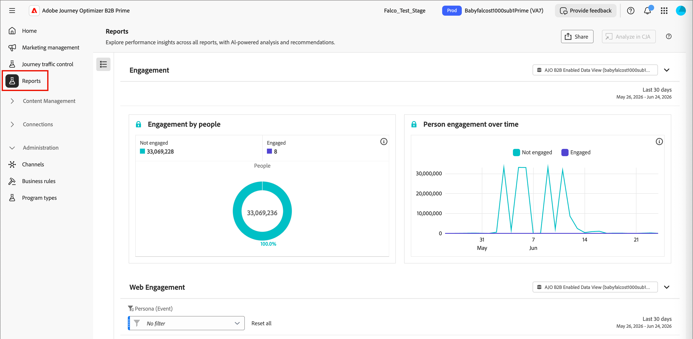
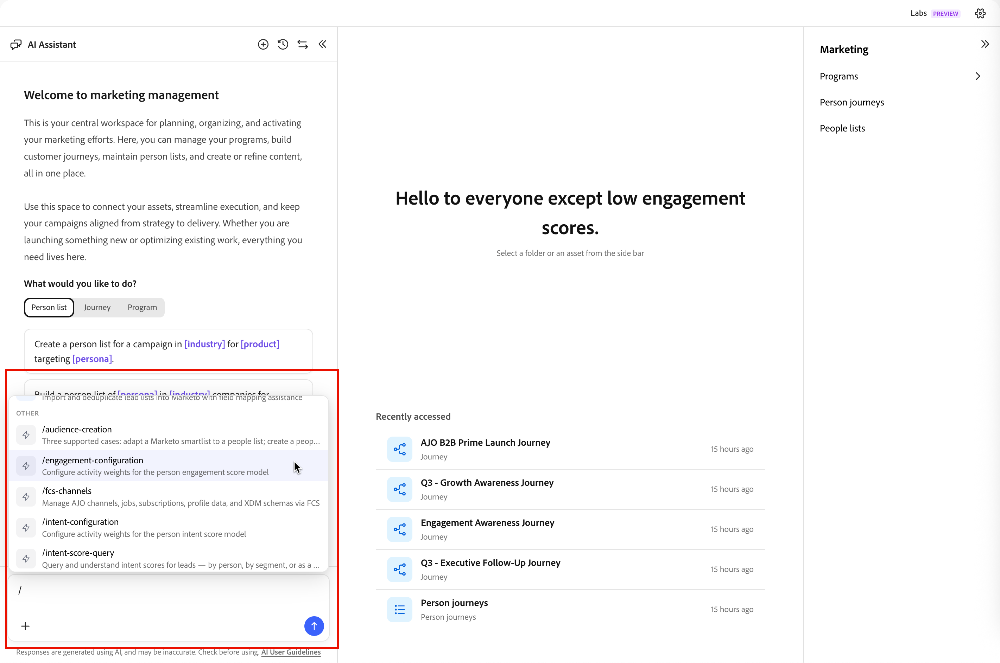
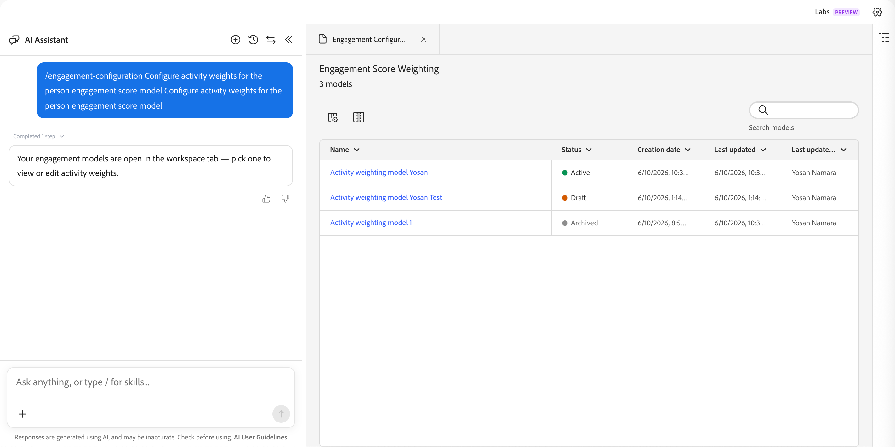

# Person engagement scores {#engagement-scores}

>[!CONTEXTUALHELP]
>id="ajo-b2b-prime_person_engagement_score"
>title="Person engagement score"
>abstract="Person engagement scores reflect the level of engagement for individual leads based on their recent activities."

A person engagement score is a number that reflects the level of engagement for an individual lead. Scores are based on the activities a person performs, where each activity type carries a weighted value. Scores are normalized within your instance (tenant) to enable consistent comparison and allow for actionable insights.

Score calculation runs daily. Any engagement-weighted activity performed by the person within the last 30 days contributes to the score. With this 30-day rolling window, older activity occurrences expire and scores can decrease over time (score decay). Displayed scores are rounded (for example, a score of 75.89999 is displayed as 76).

Engagement score data is available from **[!UICONTROL Reports]**.

{width="800" zoomable="yes"}

The person engagement score is an attribute you can use as a [filter condition](#engagement-score-filter) in people lists and split path nodes in person journeys.

## Activities used for engagement scoring {#activities}

Engagement scoring is not _trigger-based_. It is a daily process that evaluates activity for all leads and recomputes scores. Activities use _weights_ to inform scoring according to the active weighting model, which determines how much each activity type contributes to the overall score.

There is a daily frequency cap of 20 for each activity type. If a person performs the same activity more than 20 times in a single day, the count for that activity is capped at 20.

| Activity name | Direction | Description | Default weight |
|---|---|---|---|
| Attend Conference | Inbound | High-intent in-person engagement signal | 60 |
| Click Email | Inbound | Active click = meaningful engagement | 30 |
| Click Sales Email | Inbound | Active click on sales outreach | 30 |
| Click Marketo Email | Inbound | Active click = meaningful engagement | 30 |
| Engaged with Concierge | Inbound | Live engagement via concierge tool | 60 |
| Engaged with Live Chat in Concierge | Inbound | Live chat = high buying intent | 60 |
| Fill Out Marketo Form | Inbound | Form fill = explicit lead intent | 40 |
| Interesting Moment | Inbound | High-value behavioral trigger | 60 |
| New Lead | Inbound | Entry point — baseline score | 30 |
| Open Email | Inbound | Passive engagement; lower than click | 30 |
| Open Marketo Email | Inbound | Passive engagement; lower than click | 30 |
| Open Sales Email | Inbound | Passive engagement; lower than click | 30 |
| Read WhatsApp Message | Inbound | Passive read; lower-weight channel | 30 |
| Received Forward to Friend Email | Inbound | Viral signal; mild positive | 30 |
| Reply to Sales Email | Inbound | Direct reply = strong buying signal | 40 |
| Request Campaign | Inbound | Self-initiated action — high intent | 30 |
| Request Marketo Campaign | Inbound | Self-initiated action — high intent | 30 |
| Scheduled Meeting in Concierge | Inbound | Highest-intent conversion action | 60 |

>[!NOTE]
>
>Engagement score activities are recorded in the Marketo Engage activity log for a person. You can access this log in the associated Marketo Engage instance. For more information, see [Locate the Activity Log for a Person](https://experienceleague.adobe.com/en/docs/marketo/using/product-docs/core-marketo-concepts/smart-lists-and-static-lists/managing-people-in-smart-lists/locate-the-activity-log-for-a-person){target="_blank"} in the Marketo Engage documentation.

## Scoring logic {#scoring-logic}

The system applies a multi-step normalization process to produce a consistent score across all leads in your instance.

1. Identify all _engagement-weighted_ activity types that have an associated weight and daily quota, such as email clicks, form fills, and event attendance.

1. Identify all _engagement-weighted_ actions performed by the person within the look-back window, which is currently 30 days.

1. Normalize the activity type weights across all _engagement-weighted_ activity types identified in step 1, ignoring types that did not occur within the look-back window.

   This step uses _Min-Max Normalization_ and reduces the artificial dilution of activity type weight for instances that do not use most activity types.

1. Apply the daily frequency cap per person and activity type.

   This step reduces the influence of high-volume, lower-value activities on the overall score.

1. Calculate the raw engagement score by summing the daily activity per activity type, multiplying it by the associated weight, and then summing the results across all days in the look-back window.

1. To stabilize variance by reducing the impact of outliers, apply a _Power Transformation_ (Square Root).

   This transformation reduces skewness and makes patterns in the data more linear.

1. To ensure that scores use the full range from 0 to 100, apply a _Scaled Normalization_ transform.

## Filter by engagement score {#engagement-score-filter}

You can use person engagement scores as a filter when defining the audience for a people list or for segmenting in a person journey.

The _[!UICONTROL Person engagement score]_ filter appears in the filter panel under the **[!UICONTROL Person attributes]** category.

### People lists {#people-lists}

When managing members in a [static people list](./people-lists.md#static-lists) or defining rules for a [dynamic people list](./people-lists.md#dynamic-lists), you can filter by person engagement score to target people matching your criteria.

{width="700" zoomable="yes"}

**Static list — Add members**

1. Open the static list and click **[!UICONTROL Add people]** at the top right.

1. In the filter dialog, expand **[!UICONTROL People attributes]** and drag **[!UICONTROL Person engagement score]** onto the canvas.

1. In the filter condition, choose an operator and enter a value to match the scores you want to target.

1. Click **[!UICONTROL Done]** to apply the filter and qualify matching people into the list.

**Dynamic list — Set membership rules**

1. Open the dynamic list and select the **[!UICONTROL Rules]** tab.

1. Click **[!UICONTROL Edit rules]**.

1. In the filter dialog, expand **[!UICONTROL People attributes]** and drag **[!UICONTROL Person engagement score]** onto the canvas.

1. In the filter condition, choose an operator and enter a value to match the scores you want to target.

1. Click **[!UICONTROL Done]** to save the rule.

   Membership is updated automatically as person records are evaluated against the rule.

### Person journeys {#person-journeys}

When you configure segmentation for a person journey in a [_Split paths_ node](../marketing/split-merge-paths-nodes.md), you can use person engagement score as a person profile filter to control which people enter the journey path.

{width="700" zoomable="yes"}

1. Click the **[!UICONTROL Split paths]** node in the journey canvas.

1. In the node properties panel on the right, click **[!UICONTROL Apply condition]** or **[!UICONTROL Edit condition]** for a path.

1. In the filter dialog, expand **[!UICONTROL People attributes]** and drag **[!UICONTROL Person engagement score]** onto the canvas.

1. In the filter condition, choose an operator and enter a value to match the scores you want to target.

1. Click **[!UICONTROL Done]** to save the filter for the path.

## Configure engagement score weighting {#configure-weighting}

In [!DNL Marketo Optimizer], you can configure engagement score weighting directly from the [AI Assistant chat interface](../agents/chat-interface.md).

For background on engagement score models, weighting bands, and activity weights, see [Configure custom engagement score weighting](https://experienceleague.adobe.com/en/docs/journey-optimizer-b2b/user/admin/configurations/engagement-score-weighting).

1. Open the **[!UICONTROL AI Assistant]** chat panel from the left side of the screen (chat icon).

1. In the chat input field, type the forward slash command followed by your intent. For example:
  
   `/engagement-configuration Configure activity weights for the person engagement score model`

   As you type `/`, AI Assistant displays a list of available slash commands and skills. The engagement configuration command routes directly to the Engagement Score Weighting page.

   {width="700" zoomable="yes"}

1. Click the _Submit_ (up arrow) icon or press Enter.

   AI Assistant processes the request and opens an **[!UICONTROL Engagement Configuration]** tab in the main content area next to the chat panel.

### Review the engagement score weighting list {#review-weighting-list}

After the tab opens, the _Engagement Score Weighting_ page displays all existing scoring models in a table with the following columns:

| Column | Description |
|---|---|
| **Name** | The model name (click to open details) |
| **Status** | Active, Draft, or Archived |
| **Creation date** | When the model was created |
| **Last updated** | Most recent save timestamp |
| **Last updated by** | User who last saved changes |

{width="700" zoomable="yes"}

At any given time, only **one** model can be Active. The currently active model is applied to all engagement score calculations.

### Open a scoring model {#open-scoring-model}

Click the name of any model in the list to open its details page.

The detail page shows:

* Model name and current status badge (_Active_, _Draft_, or _Archived_)
* A _Search_ field to filter the activity list
* The full activity table with **[!UICONTROL Engagement activity]**, **[!UICONTROL Weighting]**, **[!UICONTROL Last updated]**, and **[!UICONTROL Last updated by]** columns

{width="700" zoomable="yes"}

For archived models, **[!UICONTROL Delete]** and **[!UICONTROL Duplicate]** are displayed at the top right. For draft models, **[!UICONTROL Activate]** is also displayed.

### Edit activity weights for a draft model {#edit-activity-weights}

Draft models have editable _[!UICONTROL Weighting]_ options for each engagement activity. To change a weight:

1. Click the draft model name in the list.

1. In the activity table, locate the engagement activity you want to update.

1. Click the **[!UICONTROL Weighting]** down arrow for that activity and select the appropriate weighting band (for example, `Important`, `Trivial`, `Minor`, `Normal`, and `Vital`).

   Changes are saved automatically — no explicit Save action is required.

>[!NOTE]
>
>To edit an active or archived model, duplicate it to create a new draft model, then edit and activate the duplicate. You cannot edit an active model in place.

### Activate a draft model {#activate-weighting-model}

Activating a draft model automatically archives the previously active model. The newly activated model then applies to all future engagement score calculations. When your draft model is configured with the correct activity weights:

1. Click the draft model name in the list.

1. Click **[!UICONTROL Activate]** at the top right.

1. Confirm in the dialog.

