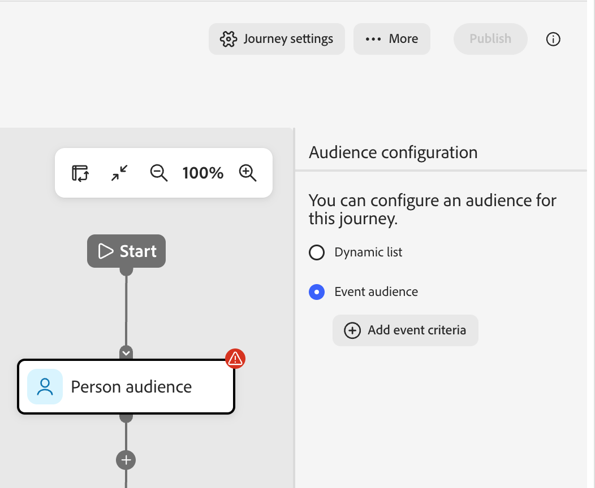

# Event-based audiences

In [!DNL Adobe Marketo Optimizer], _event‑based audiences_ let you add audience members to a live [person journey](../marketing/person-journeys.md) in near real time when a [!DNL Marketo Engage] activity occurs. You configure event‑based audiences on the Audience node of the journey canvas:

* Select one or more [!DNL Marketo Engage] activities (standard or custom) as the qualifying events.
* Optionally add person profile filters (such as industry, region, or lifecycle stage) to narrow which people can enter.
* Optionally define activity‑attribute constraints (such as a specific form, URL, or program) to narrow which occurrences of each activity qualify.

When a qualifying activity is logged in [!DNL Marketo Engage] for a lead and replicated into [!DNL Adobe Marketo Optimizer], the system evaluates the corresponding person record against your configured filters and constraints. If the conditions are met, the person enters the journey immediately through the Audience node.

_To define an event-based audience for a person journey:_

1. Select the [_Person audience_ node](../marketing/person-audience-node.md).

1. In the node properties on the right, choose **[!UICONTROL Event audience]** as the entry type.

    {width="400"}

1. Click **[!UICONTROL Add event criteria]**.

1. In the _[!UICONTROL Edit event criteria]_ dialog, add one or more [!DNL Marketo Engage] activities as qualifying events, such as:

   * _Attends webinar_
   * _Email is delivered_
   * _Clicks link in email_

   >[!NOTE]
   >
   >You can also select custom activities defined in the associated [!DNL Marketo Engage] instance.

   Set the matching operator and values for each activity.

   {width="700" zoomable="yes"}

   A person qualifies for the journey when any one of those configured activities is logged for that lead.

1. (Optional) To use an event and filter combination for audience qualification, add person‑level filters.

   * Select the **[!UICONTROL Filters]** tab.
   * Drag each filter and set the matching criteria.

   {width="700" zoomable="yes"}   

   If you add filters, the person must satisfy at least one configured activity condition and the configured filters.

1. Click **[!UICONTROL Save]**.