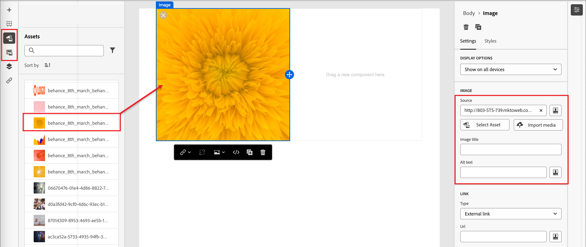

# Email content authoring

In [!DNL Adobe Marketo Optimizer], the email design space provides a visual canvas where marketers compose email. The email design tools in the left and top panels (structures, content components, templates, fragments, and more) support building from scratch with drag and drop. You can also choose to start from a template, paste raw HTML, or assemble messages from reusable visual fragments.

>[!IMPORTANT]
>
>For administrator setup of subdomains, authentication, IP pools, and email channel configurations, see [Email deliverability](../start/email-deliverability.md) and [Email channel configuration](../admin/email-channel-configuration.md).

In [!DNL Marketo Optimizer], every email is associated with a _[!UICONTROL Send Email]_ action within a person journey. The full workflow from journey design to email definition happens in one continuous experience. When you [add a _Send Email_ node](../marketing/action-nodes.md#add-an-action-node) to a person journey, click **[!UICONTROL Create email]** to start the process. First you define the Actions and content settings for the email. Click **[!UICONTROL Edit email body]** to launch the email content design space, where you can choose how you want to design your email from the following options:

* [Design your email from scratch](#design-from-scratch) using the visual design interface. Build the email layout component by component using drag-and-drop on a blank canvas. This method is best for creating new templates or one-off emails.

* [Import existing HTML content](#import-html-content) into the code editor or work side-by-side with the visual canvas.

* [Select an existing template](#templates) from a list of built-in or custom email templates. This method is best for repeatable email use cases.

<!-- * Upload a design prototype (JPG, PNG, PDF, or Figma export) and have AI Assistant convert it into a responsive HTML email. (Image to HTML (Img2HTML) -->

{width="800" zoomable="yes"}

## Email design tools {#email-design-tools}

* **Top toolbar:** Save, Back, Switch to code editor, preview controls.
* **Left panel:** Structures (column layouts), Contents (text, button, image, divider, social, HTML), Fragments, Templates, Navigation tree (DOM-style hierarchy of the email).
* **Center canvas:** WYSIWYG editor with desktop and mobile preview.
* **Right panel:** Settings and styles for the currently selected component, including content properties, background, border, padding, and personalization.

>[!BEGINSHADEBOX]

## Email design best practices {#design-best-practices}

Following HTML and CSS best practices helps ensure consistent rendering across email clients.

| Approach | Guidance |
| -------- | -------- |
| **Recommended** | Static, table-based layouts · HTML tables and nested tables · Template widths of 600–800 px · Simple inline CSS · Web-safe fonts |
| **Use with care** | Background images (limited client support) · Custom web fonts (always define a fallback font) · Layouts wider than 800 px · Image maps |
| **Avoid** | JavaScript, iframes, or Flash · Embedded audio or video · HTML forms · Div-based layouts |

>[!NOTE]
>
>Email content must also meet applicable digital accessibility requirements. Structure headings logically, provide alt text for all images, and verify color contrast in both light and dark modes.

>[!ENDSHADEBOX]

## Design your email from scratch {#design-from-scratch}

Use the visual content design space to define the structure and content of the email. By adding and moving structural components with simple drag-and-drop actions, you can design the layout and organization of the email content within seconds.

1. From the _[!UICONTROL Design your email]_ page, select the **[!UICONTROL Design from scratch]** option.

<!-- 

1. In the _[!UICONTROL Create email]_ dialog, choose the type of email content that you want to author.

   * **[!UICONTROL Use Themes]** - Choose this option to create the email in _Theme mode_. In this mode, you can use a defined brand theme to streamline the content authoring process and make sure that the design aligns with defined standards.

   * **[!UICONTROL Manual Styling]** - Choose this option to create the email in _Manual mode_. In this mode, you manually set the styling for all structure and content components that you add to the blank canvas.

-->

1. [Add structure and content components](#structure-content) in the canvas.

1. [Review and update links](#preview-and-edit-linked-urls).

1. [Test the email](#check-and-test-the-email).

When you are satisfied with the content, click **[!UICONTROL Save]**.

## Import existing HTML content {#import-html-content}

<!-- originally  from   /help/_includes/content-design-import.md but copied and revised to omit the part about Marketo Engage assets and AEM assets -->

Imported content can be:

* An HTML file with an incorporated style sheet
* A .zip file that includes an HTML file, the style sheet (.css), and images

   >[!NOTE]
   >
   >There are no constraints on the .zip file structure. However, references must be relative and fit with the tree structure of the .zip folder. The images are always uploaded to the [assets repository](./digital-asset-management.md).

_To import a file containing HTML content:_

1. From the design home page, select the **[!UICONTROL Import HTML]** option.

1. Drag and drop the HTML or .zip file containing your HTML content and click **[!UICONTROL Import]**.

{width="500"}

>[!NOTE]
>
>Using a `<table>` tag as the first layer in an HTML file can cause style loss, including background and width settings in the top layer tag.

You can personalize the imported content as needed with the visual email editor tools.

## Select a template {#templates}

When you open the email design space, use the **[!UICONTROL Select design template]** section to start from a built-in sample template or a saved custom template. See [Use a template in an email](./templates.md#use-in-journey) for the full workflow.

>[!NOTE]
>
>Saved templates can have governance (content locking) settings applied to one or more components. The visual design space provides guidelines about locked components when you [author an email from a governed template](./template-content-governance.md).

## Add structure and content {#structure-content}

Use the visual email editor to build out your email message. Add a preheader, structure the layout with columns and dividers, then populate those structures with content components such as images, buttons, and text. You can also apply custom CSS for advanced styling and preview how the design renders in dark mode.

### Set the preheader {#preheader}

The preheader is the snippet of text shown after the subject line in inbox previews. In [!DNL Marketo Optimizer], the preheader is configured on the visual canvas in the email design space — not on the email properties screen alongside the subject line.

With the **[!UICONTROL Body]** selected in the left navigation tree, open the **[!UICONTROL Settings]** panel on the right.

Click in the **[!UICONTROL Preheader]** text region and enter your preheader copy. Click the _Add personalization_ (  ) icon to apply formatting and [personalization tokens](#personalize-content) as needed using the rich-text controls. 

>[!TIP]
>
>Keep your preheader between 40 and 100 characters. It should complement the subject line (not repeat it) and give the recipient an extra reason to open the email.

### Dark mode {#dark-mode}

Dark mode rendering is supported via CSS `prefers-color-scheme` media queries. The email design tools include a dark mode preview and options to define custom styling for supporting email clients — helping you validate that text remains readable, logos are visible, and brand colors hold up against dark backgrounds.

For detailed guidance on previewing, configuring custom dark mode settings, email client support, and testing best practices, see [Dark mode for email content](./email-dark-mode.md).

### Add structure and content components {#components}

Build your email layout by adding [structure components](./structure-components.md) and [content components](./content-components.md) to the canvas.

Drag items from the **[!UICONTROL Structures]** and **[!UICONTROL Contents]** sections in the left panel, then configure each component in the _[!UICONTROL Settings]_ and _[!UICONTROL Styles]_ tabs on the right.

### Add custom CSS {#custom-css}

You can add custom CSS directly in the email design space for advanced styling beyond standard component settings. It is a best practice to add this highest-level styling before you include content components, such as images, buttons, and text.

See [Add custom CSS for your content](./design-custom-css.md) for steps, syntax rules, and troubleshooting.

>[!NOTE]
>
>If your email message is designed using a [template with locked content](./template-content-governance.md), you cannot add custom CSS to your content. The button label changes to **[!UICONTROL View custom CSS]** and any custom CSS already present in the content is read-only.

### Add fragments {#visual-fragments}

A visual fragment is a reusable design component that can be referenced by multiple content assets across [!DNL Marketo Optimizer]. It is usually a block of content that can be pre-created and quickly inserted to make authoring quicker and more consistent.

The following example outlines steps to add fragments as you author your content.

1. To open the fragments listing, select the _Fragments_ icon (  ).

   You can:

   * Sort the listing.
   * Browse, search, or filter the listing.
   * Switch between thumbnail and list views.
   * Refresh the list to reflect any of the recently created fragments.

   {width="700" zoomable="yes"}

1. Drag and drop any of the fragments into the structural component.

   The editor renders the fragment within the section/element of the email structure.

   The content of the fragment is dynamically updated within the structure to preview how the fragment renders in your email.

<!-- 
>[!BEGINSHADEBOX]

**Editable fields in customizable fragments**

A visual fragment can include editable fields that you can customize. Custom fields allow you to modify parameters when you incorporate the fragment into your content and create a tailored experience without affecting the original fragment. The fragment author can design the fragment for customization of text, image, and button components. If an included fragment contains components with editable fields, you can change the default values to customize it for your content.

1. Select the fragment component.

   The Settings displayed on the right include editable fields with the default values.

   {width="700" zoomable="yes"}   

1. Change any editable field as needed.

>[!ENDSHADEBOX]
-->

After the email is saved, it appears in the fragment details page when you select the _[!UICONTROL Used By]_ tab in the summary.

### Add image assets {#insert-image}

When [!DNL Marketo Optimizer] is provisioned, the existing Marketo Design Studio assets are available in the email design space. You can browse and insert these images into your emails directly from the asset picker.

>[!IMPORTANT]
>
>Asset availability in [!DNL Marketo Optimizer] is based on a **one-time copy** of your assets from Marketo Design Studio. Modifying assets in Marketo Engage after the initial copy is **not** reflected in [!DNL Marketo Optimizer]. You can also upload image assets directly from the visual design space or the [Assets library](./digital-asset-management.md).

Supported image file types:

* **Fully supported** (visible in picker, embeddable inline): JPG, PNG, GIF, WebP.
* **Accessible with caveat**: SVG (with a warning that some email clients do not render SVG).
* **Not supported in this Beta release:** TIFF, PDF, DOCX, XLSX, PPTX, CSS, JS, HTML, TXT, binary files, PSD, AI, INDD.

In the visual content design space, select the _Assets_ (  ) icon in the left navigation bar. From the asset selector, you can directly select assets stored in the Assets library.

* Add a new asset by dragging and dropping the image asset into a structure component.

   {width="800" zoomable="yes"}

* Replace an existing image asset by selecting it on the canvas and clicking **[!UICONTROL Select Asset]** in the image source tools.

   {width="600" zoomable="yes"}

For more information about using assets, see [_Use assets for content authoring_](./digital-asset-management.md#assets-authoring).

### Navigate the layers, settings, and styles {#navigation-layers}

Use the navigation tree to select components and columns, then adjust their settings and styles in the right panel. See [Navigation tree](./structure-components.md#navigation-tree).

### Personalize content {#personalize-content}

[!DNL Marketo Optimizer] uses Handlebars syntax for personalization. Tokens are replaced at send time with values from each recipient's profile data. There are multiple places where you can use personalization in an email:

* **Subject line** — most common personalization point.
* **Preheader** — set inside the visual canvas; supports profile attribute tokens.
* **Email body text** — first names and other profile attributes inserted inline.
* **Button URLs** — append per-recipient parameters.

>[!NOTE]
>
>Only profile attributes are available in the Personalization Editor in this Beta release.

_To add personalization:_

1. In the email design space (or on the email properties page for the subject line), click the field where you want to insert a token.
1. Click the _Personalize_ (  ) icon to use a personalization token.
1. In the personalization dialog, browse the schema tree on the left. Profile attributes (first name, last name, email, job title, and other profile fields) are listed.
1. Select an attribute. The editor inserts the corresponding Handlebars expression — for example, `{{profile.firstName}}`.
1. Add a fallback value to handle missing data: `{{profile.firstName | default: "there"}}`.
1. Click **[!UICONTROL Confirm]** or **[!UICONTROL Insert]**. The expression appears inline in the field.

+++Common personalization patterns {#personalization-patterns}

Use Handlebars expressions such as the following (personalization uses the same syntax described in [Personalize content](#personalize-content)):

* `{{profile.lastName}}` — Insert the recipient's last name.
* `{{profile.jobTitle}}` — Reference the recipient's job title in body copy.
* `{{profile.firstName}}, ready to take the next step?` — Combine token and static text inline.

For a first-name greeting with a fallback when the value is missing, use the `default` helper as shown in the earlier personalization steps (for example, first name with default `"there"`).

+++

+++Handlebars helpers {#handlebars-helpers}

Beyond `default`, the personalization editor includes built-in Handlebars helpers for conditional logic, text transformation, and date formatting. Use the editor's function browser to explore available helpers and insert them with the correct syntax.

>[!TIP]
>
>In the email design space, type `{{` directly in any text field to trigger an inline autocomplete dropdown listing available profile attributes — no need to open the full personalization dialog for quick insertions.

+++

+++AI-assisted expressions {#ai-personalization}

The AI Assistant in the personalization editor can generate Handlebars expressions from a plain-language description, explain what an existing expression does, and identify potential issues. Use it to accelerate expression authoring, especially for conditional logic or date-formatting helpers.

+++

For details about expression editor tools and syntax, see [Personalization expressions](./personalization-expressions.md).

### Edit linked URL tracking {#preview-and-edit-linked-urls}

{{$include /help/_includes/content-design-links.md}}

## Check and test the email {#check-and-test-the-email}

Use the desktop and mobile preview controls in the email design space toolbar to review your email layout before saving. Switch to dark mode preview to validate readability and contrast (see [Dark mode for email content](./email-dark-mode.md)).

Test profiles, [!UICONTROL Simulate content], and send proof workflows are not available in this Beta release. See [Current limitations](../marketing/email-channel.md#limitations) in the email channel overview.

Review [Validating email content](#validation) for content alerts you must resolve before journey activation.

## Validating email content {#validation}

Before your journey can be activated, the email content must be valid. [!DNL Marketo Optimizer] surfaces content-level alerts on the email and on the journey canvas. This section covers the alerts you may see and how to resolve them.

### Common content alerts {#content-alerts}

| Alert | What it means | How to resolve |
| ----- | ------------- | -------------- |
| **Subject line is missing** | The Subject line field is empty. | Open the email and enter a subject line on the **[!UICONTROL Content]** tab. Personalization tokens are allowed but the field cannot be empty. |
| **Email body is empty** | The canvas in the email design space has no content. | Click **[!UICONTROL Edit email body]** to open the email design space. Drag at least one Structure and one Content component onto the canvas, then click Save. |
| **Channel configuration not selected** | No email channel configuration has been chosen for the email node. | On the **[!UICONTROL Actions]** tab, select an Active **[!UICONTROL Email channel configuration]**. |
| **Channel configuration deleted** | The previously selected channel configuration has been deleted or is no longer Active. | On the **[!UICONTROL Actions]** tab, select another Active **[!UICONTROL Email channel configuration]**. If none are available, an administrator must create or reactivate one in [Email channel configuration](../admin/email-channel-configuration.md). |
| **Email size exceeds 100 KB** | Total email size (HTML, inline CSS, encoded content) is larger than the 100 KB ISP best-practice cap. | Reduce the email size: replace large inline images with externally-hosted images from Marketo Design Studio, remove unused inline CSS, simplify nested structures. |
| **Unresolved personalization token** | A Handlebars token references a profile attribute with no fallback, and the attribute may be missing for some recipients. | Add a fallback using the Handlebars `default` helper as described in [Personalize content](#personalize-content). Alternatively, restrict the journey audience to profiles where the attribute is guaranteed. |
| **Image not loaded** | An image component references an asset that is no longer available. | Click the image, open the asset picker, and re-select the asset from the Assets library. |
