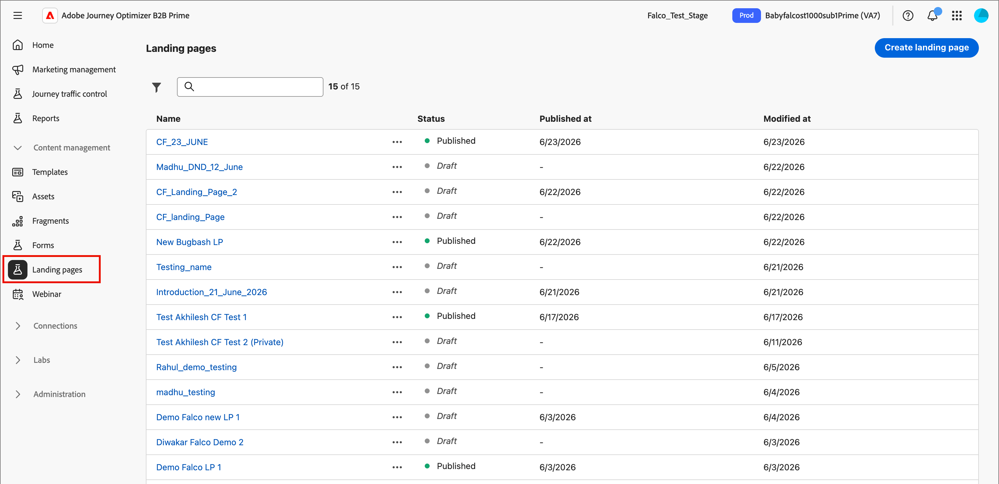
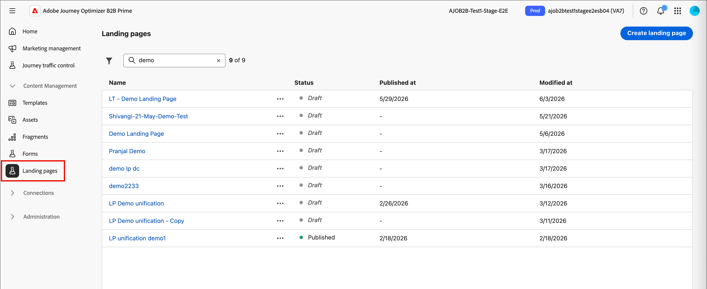

# Landing pages

A landing page is a standalone web page where you can direct contacts and customers after they click a linked item in an email, SMS message, or any digital location. You can incorporate these pages into your journeys to get your prospects and customers to view your messages on the web and progress along in your journeys.

Common use cases for landing pages:

* Provide opt in or opt out of marketing communications or a specific service. Use a link in an email or other communication to a targeted list.
* Collect consent before sending communications and send a confirmation email upon opt-in or opt-out.
* Capture or update profile data (progressive profiling, preferences, registrations, and similar scenarios) using forms on landing pages.
* Direct people to campaign-specific information designed for your journey orchestration.
* Redirect people to a dedicated web form without building an external page outside of [!DNL Marketo Optimizer].

## Landing page workflow {#workflow}

To direct members of a journey audience to a defined web page when they click a specific link, create a landing page in [!DNL Marketo Optimizer]: 

1. [Create the page](./landing-pages-create-publish.md#create-landing-page) - Select a preset, set up the primary page, and add any required subpages.
1. [Design the landing page content](./landing-page-design.md) - Build the page content using drag-and-drop visual design components.
1. [Test the landing page](./landing-pages-create-publish.md#test-landing-page) - Preview the page and test form behavior.
1. [Publish the landing page](./landing-pages-create-publish.md#publish-landing-page) - Publish to make the page live and available for linking.
1. [Link to the page from your journey](#link-to-landing-page) - Add the landing page URL to an email, SMS, or journey action so that recipients can reach it.

For example, you can create and design landing pages to direct your users to online information. The page could include a form where they can opt in or opt out from receiving your communications. Or it could be an opportunity to subscribe to a recurring communication, such as a newsletter.

## Access and manage landing pages {#access-manage-landing-pages}

To access landing pages in [!DNL Marketo Optimizer], go to the left navigation and expand **[!UICONTROL Content Management]**. Then select **[!UICONTROL Landing pages]**. This action displays a list of all landing pages created in the instance.

{width="800" zoomable="yes"}

The list is sorted according to the _[!UICONTROL Modified]_ column, with the most recently updated items at the top. Click the column title to change between ascending and descending.

### Filter the landing pages list {#filter-list}

To search for a landing page by name, enter a text string into the search bar for a match. Click the _Filter_ icon (  ) to show the available filter options and change the settings to filter the displayed items according to your specified criteria.

{width="800" zoomable="yes"}

<!-- 
This is going away? ### Customize the column display

Customize the columns that you want to display in the table by clicking the _Customize table_ icon (  ) at the top right. 

In the dialog, select the columns to display and click **[!UICONTROL Apply]**.

{width="300"} 
-->

### Landing page status and lifecycle {#landing-page-status}

The landing page status determines its availability for linking in your email and SMS content, and the changes that you can make to it. 

| Status               | Description |
| -------------------- | ----------- |
| Draft                | When you create a landing page, it is in draft status. It remains in this status as you define or edit the visual content and until you publish it as a hosted page. Available actions: <ul><li>Edit name or description</li><li>Edit link URL</li><li>Edit in visual design space</li><li>Publish</li><li>Duplicate</li><li>Delete</li></ul> |
| Published            | When you publish a landing page, it is hosted on the [!DNL Marketo Optimizer] instance and it becomes available for linking in an email or SMS message content. Available actions: <ul><li>Edit name or description</li><li>Edit link URL</li><li>Add link in email or SMS message content</li><li>Create draft version</li><li>Duplicate</li><li>Delete</li></ul> |
| Published with draft | When you create a draft from a published landing page, the published version remains, and the draft content can be modified in the visual design space. If you publish the draft version, it replaces the current published version and the content is updated in the hosted page. Available actions: <ul><li>Edit name or description</li><li>Edit link URL</li><li>Add link in email or SMS message content</li><li>Edit draft version in visual design space</li><li>Publish draft version</li><li>Duplicate</li><li>Delete (deletes both versions)</li><li>Discard draft (returns to published status)</li></ul> |

{zoomable="yes"}

## Edit a landing page {#edit-landing-page}

Edits to a landing page depend on its current status:

* When a landing page is in **_Draft_** status, you can edit any of its details, the URL, and the visual content.
* When a landing page is in **_Published_** status, you can edit the description, but not the name. To change the visual content, you must create a draft version of the page.
* When a landing page is in **_Published with draft_** status, editing the details is limited to the description. You can also edit the visual content for the draft version.

>[!BEGINTABS]

>[!TAB Draft]

1. From the _[!UICONTROL Landing pages]_ listing page, click the landing page name to open it.

   A preview of the visual content is displayed, with the landing page details on the right.

1. Modify any of the details, such as name and description.

   {width="700" zoomable="yes"}

1. To make changes to the content in the visual design space, click **[!UICONTROL Edit landing page]**.

   Use the visual design tools as needed:

   * [Add structure and content](./landing-page-design.md#structure-content-landing-page)
   * [Add assets](./landing-page-design.md#add-assets)
   * [Navigate the layers, settings, and styles](./landing-page-design.md#navigate-layers-settings-styles)
   * [Personalize content](./landing-page-design.md#personalize-content)
   * [Edit linked URL tracking](./landing-page-design.md#linked-url-tracking)

1. Click **[!UICONTROL Save]**, or **[!UICONTROL Save & close]** to return to the landing page details.

1. When the page meets your criteria and you want to make it available for display, click **[!UICONTROL Publish]**.

>[!TAB Published]

1. From the _[!UICONTROL Landing pages]_ listing page, click the page name to open it.

   A preview of the visual content is displayed, with the landing page details on the right.

1. Modify the description, if needed.

   For a published landing page, all other details cannot be changed.

1. If you want to update the content, click **[!UICONTROL Edit landing page]** on the right.

   Click **[!UICONTROL Create draft version]** in the dialog to open the draft version in the visual design space.

   Use the visual design tools as needed:

   * [Add structure and content](./landing-page-design.md#structure-content-landing-page)
   * [Add assets](./landing-page-design.md#add-assets)
   * [Navigate the layers, settings, and styles](./landing-page-design.md#navigate-layers-settings-styles)
   * [Personalize content](./landing-page-design.md#personalize-content)
   * [Edit linked URL tracking](./landing-page-design.md#linked-url-tracking)

1. Click **[!UICONTROL Save]**, or **[!UICONTROL Save & close]** to return to the landing page details.

1. When the draft landing page meets your criteria and you want to make the changes available on the published page, click **[!UICONTROL Publish]**.

   When you publish the draft version, it replaces the current published version and the content is updated for the page URL.

>[!TAB Published with draft]

When you open the landing page, the draft version is displayed. The tabs at the top of the preview space allow you to toggle the display between the published and draft versions. The draft actions and details are displayed on the right. 

{width="700" zoomable="yes"}

_To update the content:_

1. Click **[!UICONTROL Edit landing page]** at the top right. Use the visual design tools as needed:

   * [Add structure and content](./landing-page-design.md#structure-content-landing-page)
   * [Add assets](./landing-page-design.md#add-assets)
   * [Navigate the layers, settings, and styles](./landing-page-design.md#navigate-layers-settings-styles)
   * [Personalize content](./landing-page-design.md#personalize-content)
   * [Edit linked URL tracking](./landing-page-design.md#linked-url-tracking)

1. Click **[!UICONTROL Save]**, or **[!UICONTROL Save & close]** to return to the landing page details.

1. When the draft page meets your criteria and you want to make the changes available, click **[!UICONTROL Publish]**.

   When you publish the draft version, it replaces the current published version and the content is updated in the hosted page.

>[!ENDTABS]

## Duplicate a landing page {#duplicate-landing-page}

You can duplicate a landing page using either of the following methods:

* From the _[!UICONTROL Landing page]_ listing page, click the _More_ icon (**...**) next to the landing page name and choose **[!UICONTROL Duplicate]**.
* At the top right of the landing page details page, click **[!UICONTROL ... More]** and choose **[!UICONTROL Duplicate]**.

{width="600" zoomable="yes"}

In the dialog, enter a useful name (unique) and description (optional). Click **[!UICONTROL Duplicate]** to complete the action.

{width="350"}

The duplicated (new) page then appears in the _Landing pages_ listing.

## Delete a landing page {#delete-landing-page}

You can delete a landing page using either of the following methods:

* From the _[!UICONTROL Landing page]_ listing page, click the _More_ icon (**...**) next to the landing page name and choose **[!UICONTROL Delete]**.
* At the top right of the landing page details page, click **[!UICONTROL ... More]** and choose **[!UICONTROL Delete]**.

This action opens a confirmation dialog. You can abort the process by clicking **[!UICONTROL Cancel]**, or click **[!UICONTROL Delete]** to confirm deletion.

{width="400"}

## Link to a landing page {#link-to-landing-page}

As a marketer or creative that produces email, fragment, and page content, you can embed links to the published (live) landing pages that are created in your [!DNL Marketo Optimizer] instance.

1. As you work in the visual design space for a fragment, email, landing page, or template, select an excerpt of text, a button component, or an image component for the link.

   The **[!UICONTROL Link]** options are displayed in the right panel.

1. For the **[!UICONTROL Type]** option, choose **[!UICONTROL Landing page]**.

   {width="700" zoomable="yes"}

1. For the **[!UICONTROL Landing page]** option, click the _Select page_ icon (  ).

1. In the Select landing page dialog, set the **[!UICONTROL Landing page source]** as **[!UICONTROL Journey Optimizer B2B Edition]**, select the checkbox for the landing page from the list of published pages, and click **[!UICONTROL Select]**.

   {width="600" zoomable="yes"}

1. For the **[!UICONTROL Target]** option, choose the link target behavior:

   * **[!UICONTROL None]** - Opens the link using the browser default behavior.
   * **[!UICONTROL Blank]** - Opens the link in a new window or tab.
   * **[!UICONTROL Self]** - Opens the link in the same frame.
   * **[!UICONTROL Parent]** - Opens the link in the parent frame.
   * **[!UICONTROL Top]** - Opens the link in the full body of the window.

1. (Text link only) If you want to underline the linked text, select the **[!UICONTROL Underline link]** checkbox.

   You can set additional styling for the link text, including the link color, by selecting the **[!UICONTROL Styles]** tab in the right panel.
