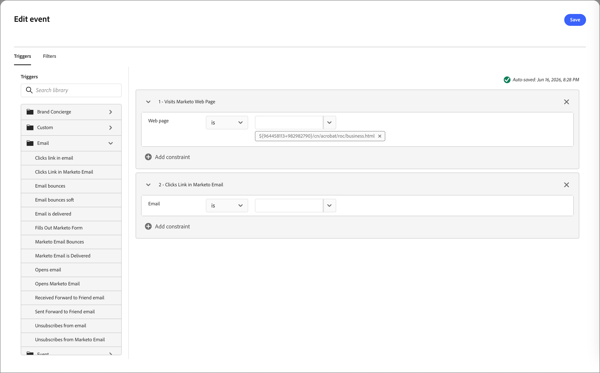
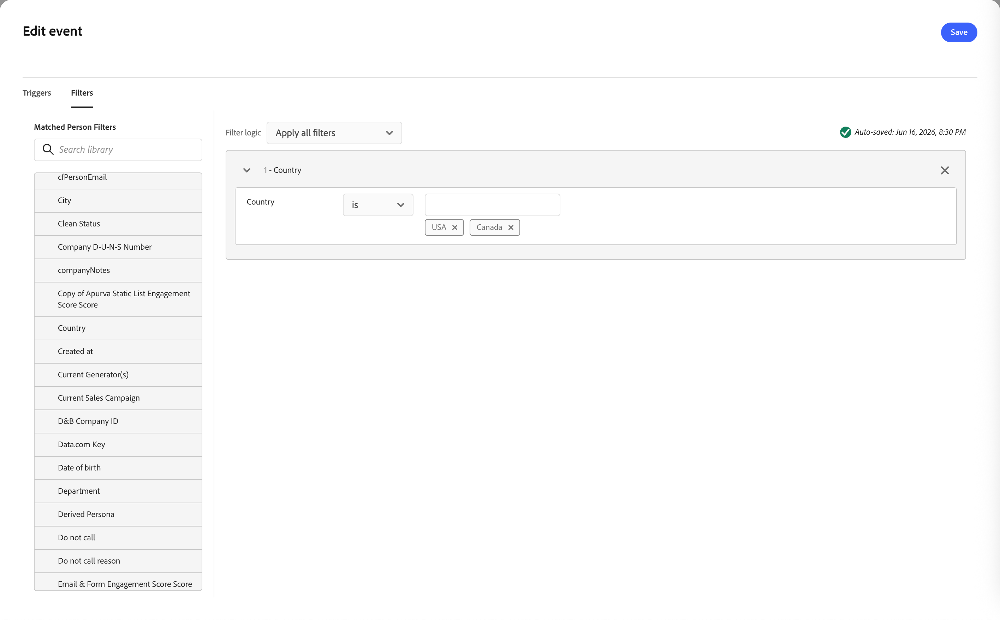

# Listen for an event node

Add the _Listen for an event_ node to move your audience forward to the next step in the journey when an event occurs.

## Event triggers {#event-triggers}

You can build triggers around [!DNL Marketo Engage] activities, such as:

* Fills Out Form - Fires when a person submits a [!DNL Marketo Engage] form on your landing page.
* Visits Web Page - Fires when a lead views a tracked webpage (you can specify exact URLs or use wildcards).
* Clicks Link - Fires when a tracked link in a marketing email is clicked.
* Data Value Changes - Fires when a specific field (like Lead Status, Score, or Industry) is updated on a person's record.
* Campaign is Requested - Often used for API or webhook integrations, this trigger kicks off a campaign when another program or web service calls it.
* Score is Changed - Fires when an individual's lead score increases or decreases past a certain threshold.
* Mobile Push Tapped - Fires in mobile marketing smart campaigns when a push notification is interacted with on a device.

## Event filters {#event-filters}

| Filters | Description |
| ------- | ----------- |
| Activity history > Email | Email activities based on conditions that are evaluated using one or more selected email messages: <li>Clicked link in email <li>Opened email |
| Activity history > Data Value Changed | For a selected person attribute, a value change occurred. These change types include: <li>New value <li>Previous value <li>Reason <li>Source <li>Date of activity <li> Min. number of times |

## Add an event node {#add-event-node}

1. Navigate to the journey canvas.

1. Click the plus ( **+** ) icon on a path and choose **[!UICONTROL Listen for an event]**.

   {width="200"}

1. In the node properties on the right, click **[!UICONTROL Add event criteria]**.

1. In the _[!UICONTROL Edit event]_ dialog, add the events to trigger.

   {width="600" zoomable="yes"}

1. (Optional) Select the **[!UICONTROL Filters]** tab in the dialog and add filtering criteria for the triggers.

1. Click **[!UICONTROL Edit event]** and define details for the event.

   {width="600" zoomable="yes"}

1. Click **[!UICONTROL Save]**.

<!--
1. If needed, set the **[!UICONTROL Timeout]** option to limit the time period to listen for the event.

   >[!NOTE]
   >
   >The journey ends after a timeout unless you define a timeout path, where you can add other nodes.

   Enable the **[!UICONTROL Timeout]** option and select the duration for which the journey waits for an event to occur before it times out.

   You can choose to end the path here or take a different course of action by setting another path. To create a new path in the journey where you can add actions and events applicable to accounts when the event does not occur, select the **[!UICONTROL Set timeout path]** check box.

   {width="700" zoomable="yes"}
-->

>[!NOTE]
>
>The timeout functionality for Listen for an event node does not currently function. It is planned for a later release.

