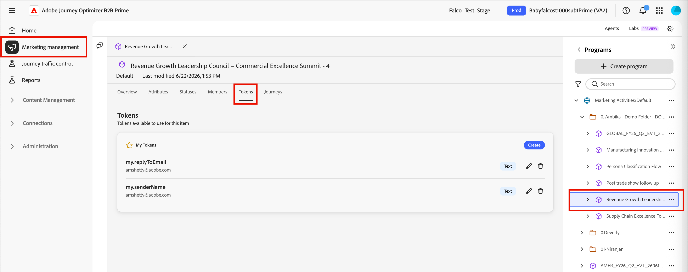

# Custom tokens for personalization

Content personalization uses tokens as placeholders or variables that are populated when the content artifact is generated. Standard personalization tokens are available for emails, landing pages, fragments, and templates. You can also define a set of custom tokens with values that are specific to the program or folder. This set of custom tokens is called _My Tokens_ and any of these custom tokens are for personalization.

When you add a custom token to an email, it is displayed as `{{my.TokenName}}`. For example, you might have `{{my.EventDate}}` or `{{my.WebinarSpeaker}}` tokens created to manage email content related to upcoming webinars.

In addition to _My Tokens_, which are specific to the program or folder, you can use any of the standard (built-in) tokens for personalization.

>[!NOTE]
>
>_My Tokens_ are not currently enabled in the Personalization Editor for this Beta release.

## Access tokens

1. On the left navigation, expand **[!UICONTROL Marketing Management]**.

1. On the right in the **[!UICONTROL Marketing]** resource list, select **[!UICONTROL Programs]**.

1. It the tree structure, slect the program or folder to open the deatils in the center workspace.

1. Click the **[!UICONTROL Tokens]** tab.

   {width="800" zoomable="yes"}

   The tab displays all custom tokens that are defined within the folder or program, and any defined for parent folders or programs.

### Token types {#my-tokens}

The _My Tokens_ are custom variables that you create or modify for a program or folder. This custom token set supports the following token types:

| Token type | Description |
| ---------- | ----------- |
| Text  | This type holds a standard text string. The size limit for text tokens is 524,288 characters (UTF-8), or 2 MB. |
| Date | This type holds a date value. The date displays as month-day-year (for example, 09-23-2026). |
| Date & Time | This type holds a date and time value. |
| Number | This type holds a standard integer value. |
| Email | This type holds a valid email address. |
| Score | Use this token for a change in score for a journey action node. |
| Boolean | This type holds a standard boolean value, true or false. |
| Rich Text | This type holds formatted text. |

### Token nesting

When you create a token in a program or folder, it is available for reference by other child objects. 

* Local token - The token is defined in the same program or folder.
* Inherited token - The token is defined in a parent program or folder, one or more levels above the current program or folder.
* Overridden token - The token is defined in a parent program or folder, but a different value is defined at the current program or folder. The token status changes to _Overridden_, and any child folders, programs, and marketing artifacts inherit the new value.

{width="600" zoomable="yes"}

### Create a token

1. In the _[!UICONTROL Tokens]_ tab, click **[!UICONTROL Create]**.

1. In the dialog, enter the **[!UICONTROL Name]** for the token.

   {width="400"}

   You cannot use spaces or special characters in the token name. You can use _camel case_, such as `EventType`, to use a multi-word name that is easily identified.

1. Choose the **[!UICONTROL Type]** for the toekn.

1. Set the **[!UICONTROL Value]** for the token.

1. Click **[!UICONTROL Create]**.

### Edit a token

You can edit the value for any of the defined My Tokens. Do this to override the value for an inherited token.

<!-- (How does this affect live person journeys? ) -->

1. On the _[!UICONTROL Tokens]_ , click the _Edit_ icon next to the token name.

1. In the field, change the value as needed.

   {width="400"} 

1. Click the _Save_ icon.

### Delete a token

You can delete a custom token from the list if it is not currently used in journey email content.

1. On the _[!UICONTROL Tokens]_ , click the _Delete_ icon next to the token name.

1. In the confirmation dialog, click **[!UICONTROL Delete]**.

<!--

## Use custom tokens in your content

When you are authoring email content for your programs, you can use any of the tokens from the _My Tokens_ list when you use the personalization tools in the visual design space.

1. Select the text component and click the _Add personalization_ (  ) icon in the toolbar.

   {width="600"}

   This action opens the _Edit Personalization_ dialog. The dialog includes a _[!UICONTROL My tokens]_ folder in the _[!UICONTROL Personalization Tokens]_ library if there are custom tokens defined for the account journey.

1. To add one of your custom tokens to the blank space, expand the **[!UICONTROL My tokens]** folder, then click **+** or **...**.

   You can add any additional static text as needed.

   {width="700" zoomable="yes"}

1. Click **[!UICONTROL Save]**.

-->
