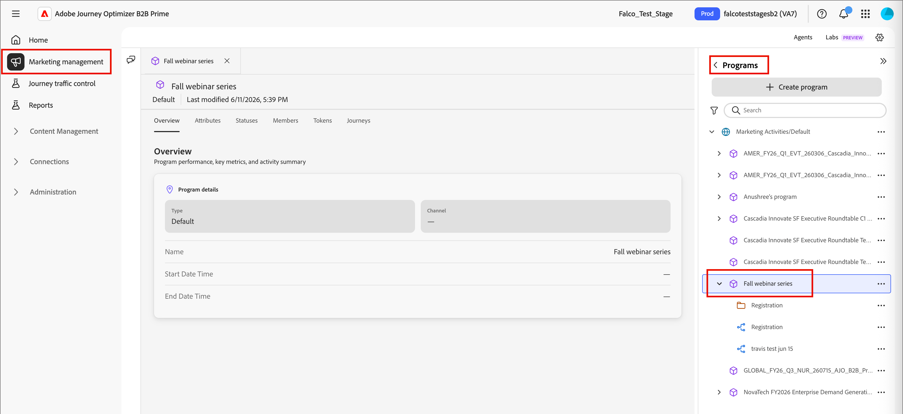

# Programs

Programs are designed to give shared context to your marketing collateral and journeys, so you can manage all the aspects of a marketing effort from a single place. Use program attributes to describe your program, and use the _Member of Program_ filter to segment audiences based on program membership, member status, and success. From the Tokens tab, you can manage both local _My Tokens_ and tokens that are inherited in your folder structure.

## Access programs {#access-programs}

Each program lives in the _[!UICONTROL Marketing]_ folder structure, and can contain journeys, lists, and other resources to organize your marketing efforts. 

1. On the left navigation, expand **[!UICONTROL Marketing Management]**.

1. On the right in the **[!UICONTROL Marketing]** resource list, select **[!UICONTROL Programs]**.

1. Use the _Search_ and _Filter_ tools to find items within the structure. 

1. Select a program or folder in the structure to open its details in the center workspace.

   {width="800" zoomable="yes"}

   Select any of the tabs to access program or folder details or contents.

## Create a program {#create-program}

>[!IMPORTANT]
>
>Each program is based on a [program type](../admin/program-types.md), which defines important aspects of the program and its members. Make sure that you have a defined program type to support your program before you create it.

1. Click **[!UICONTROL Create Program]** at the top of the program tree structure.

1. In the dialog, select the **[!UICONTROL Parent]** location within the Programs structure.

   This can be the root, a folder, or an existing program.

1. Enter a unique **[!UICONTROL Name]** (required).

   {width="400"}

1. Choose **[!UICONTROL Program type]**, which determines the program attributes and member statuses.

1. (Optional) Enter a **[!UICONTROL Description]** for the program.

   >[!TIP]
   >
   >Including a description is a best practice, and makes your programs more accessible and discoverable.

1. Click **[!UICONTROL Create]**.

## Attributes {#attributes}

Each program inherits a set of attributes from its [program type](../admin/program-types.md). Use attributes to describe the important aspects of your marketing programs, such as event dates and location attributes.

>[!NOTE]
>
>Coming after Beta: Program Attributes as Tokens and as Member of Program constraints

## Statuses {#statuses}

Each program inherits a set of member statuses from its program type. These statuses can be assigned to program members for use in audience segmentation with the Member of Program filter.

Each status is assigned to a step in the program type, like 1, 2, or 3. Members of a program can only move from a status with the same step number (for example, from _No-Showed_ to _Attended_), or to a status with a higher step number (for example, from _Invited_ to _Registered_).

In the program type, statuses with _[!UICONTROL Mark as success]_ selected are considered successful.

### Change program status {#change-program-status}

To add a person to a program or to change their status, they must pass through a **_[!UICONTROL Change Program Status]_** [action in a journey](./action-nodes.md). This makes them a member of the program, and assigns them a status in that program.

### Correct a program status {#correct-program-status}

If people have been assigned to a status by mistake and cannot be moved forward or laterally to the correct status, you can correct this by first setting the person to _Not in Program_, then setting them to the correct status.

## Members {#members}

The **Members** tab shows an inventory of the people who are members of the program.

<!-- How do they get there? I don't see this populated for any of the programs that I have reviewd -->

## Tokens {#tokens}

Use _My Tokens_ to easily manage program details that appear in many places, such as event dates and locations, email footers, fiscal years and quarters, and more. These program-specific tokens are special strings designed for reuse across journeys or marketing assets to substitute a predetermined value. For example: 

_You're invited to attend our expo on `{{my.Event Date}}`._

If you send this email through a journey under a program with an _Event Date_ My Token set to `2026-01-01`, the recipient sees:

_You're invited to attend our expo on 2026-01-01._

My Tokens can also be assigned at the folder level Folders and programs both inherit any My Tokens defined for a parent in the tree. An inherited token can be overridden if a different value is for the same token is defined at a lower level. For example, you might define an email footer at the top of your folder structure, but change the copyright language for a co-marketing event with a partner, or change the URL of a promotional banner for a product-specific program.

For more information about defining and using My Tokens, see [Custom tokens for personalization](./personalization-my-tokens.md).

## Member of Program filter {#member-of-program}

_Member of Program_ is a filter that lets you segment your dynamic lists based on whether someone is a member of a program, what status they are in, and whether they are successful in that program. Be careful when using the **_Program_** and **_Status_** constraints together — use matching types with the programs you use for filters, otherwise it could inadvertently create an audience that cannot have any members.
