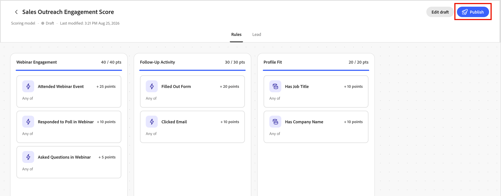
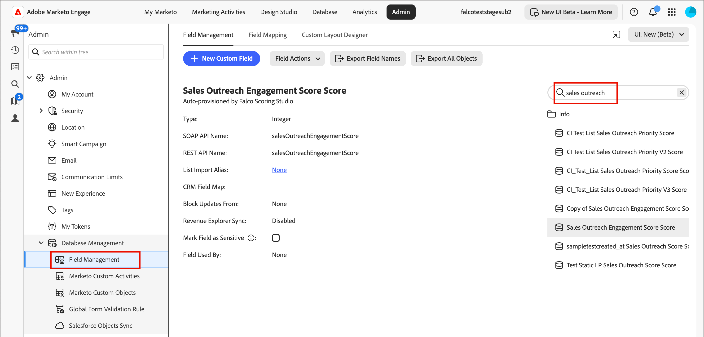
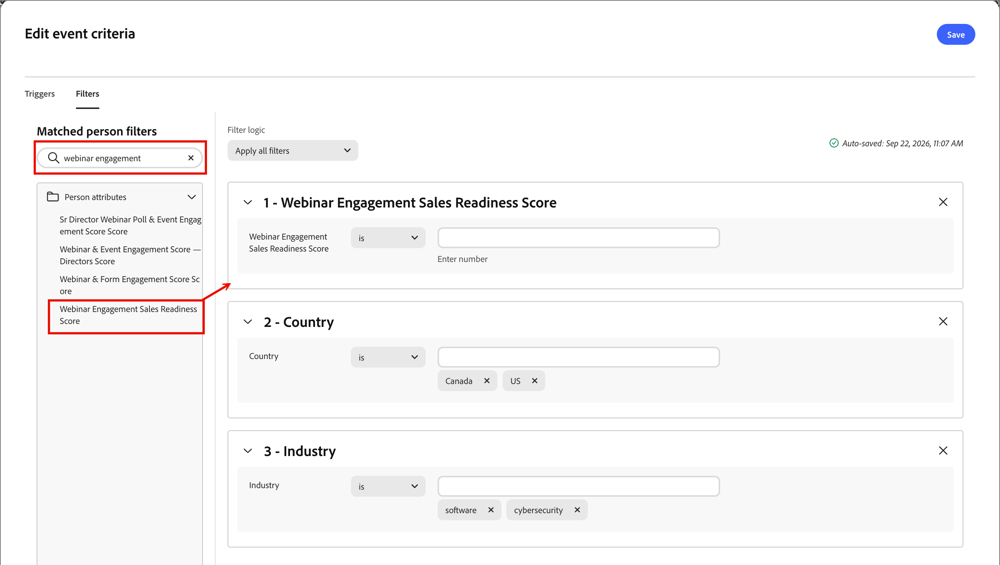

# Scoring Studio

Scoring Studio includes a model list, an editable canvas for each model, and the [Coworker chat interface](../agents/chat-interface.md). Use the canvas to review or adjust dimensions and signals directly, while Coworker continues to propose changes in natural language alongside you. For information about building a model from a prompt, see [_Create custom scoring models_](../agents/lead-scoring-model.md).

## Model list {#model-list}

The model list is the landing view for Scoring Studio. It shows every scoring model in your [!DNL Marketo Optimizer] instance as rows in a table, or as cards if you switch to grid view.

{width="800" zoomable="yes"}

| Column | Description |
| --- | --- |
| Name | Select a model name to open it on the canvas. |
| Status | _[!UICONTROL Active]_, _[!UICONTROL Draft]_, or _[!UICONTROL Archived]_. |
| Dimensions | The number of dimensions in the model. |
| Signals | The number of signals in the model. |
| Last modified | The date the model was last changed. |
| Last modified by | The person who last changed the model. |
| Created on | The date the model was created. |
| Created by | The person who created the model. |

Use the search field to find a model by name, or filter the list by status. Select a row's **[!UICONTROL More menu]** to **[!UICONTROL Edit]**, **[!UICONTROL Duplicate]**, **[!UICONTROL Archive]**, or **[!UICONTROL Delete]** a model.

An active model is read-only. To change it, duplicate it and edit the duplicate. Then, archive the original and publish the modified copy.

## Model canvas {#model-canvas}

Selecting a model name opens it on the canvas. Each open model appears as its own tab, so you can work across multiple models. The canvas is organized into tabs, including **[!UICONTROL Rules]** and **[!UICONTROL Lead]**.

On the **[!UICONTROL Rules]** tab, every dimension in the model is a column on the canvas. Each column header shows the dimension name and its point total against its cap, for example `20 / 30 pts`, with a progress bar that fills as its signals contribute points.

{width="700" zoomable="yes"}

Inside each dimension, every signal appears as a card showing its name, its point value, and either its matching frequency (for example, `1 time / day`) or `Static` for attribute-based signals that do not depend on activity.

When Coworker detects a pattern across multiple activities, it can combine them into a single composite signal card that summarizes every condition.

## Configure a signal {#configure-signal}

To review or change a signal, follow these steps.

1. Select **[!UICONTROL Edit draft]**.

1. Select a signal card on the canvas.

   The properties panel opens on the right side of the canvas.

   {width="700" zoomable="yes"}

1. Select the **[!UICONTROL Edit]** icon (  ), then update the signal properties:

   * Under **[!UICONTROL Signal]**, confirm the signal type (an activity or an attribute) and which specific activity or attribute it scores.

   * Under **[!UICONTROL Fire this on]**, set the conditions that must match.

      Add the items to use, such as specific pages, and whether **[!UICONTROL Any of]** or **[!UICONTROL All of]** the conditions must be true.

   * Under **[!UICONTROL Points]**, set how many points the signal contributes.

      Optionally, set a **[!UICONTROL Cap]** to limit how many points it can contribute per person. Coworker shows a suggested point range based on the other signals in the model.

   * For activity-based signals, set the **[!UICONTROL Frequency]** required before the signal awards points.

      Optionally, set a **[!UICONTROL Decay]** percentage that reduces the signal's points after a set number of days.

   * Enable the **[!UICONTROL Avoid scoring the same actions twice]** option to award points only once per person, no matter how many times the activity happens.

     Disable the option to award points every time the activity happens instead. This setting is on by default.

1. Select **[!UICONTROL Save]** to apply your changes and return to the canvas.

## Lead segment {#lead-segment}

Every scoring model scores one lead segment, a reference to an existing person list rather than rules you define inside Scoring Studio. When Coworker creates a model, it selects a matching list or creates a new one.

To change the list, select the **[!UICONTROL Lead]** tab, then select **[!UICONTROL Change]** next to the lead segment.

{width="700" zoomable="yes"}

A lead segment uses one of two list types:

* **Static list** — a fixed set of people captured when the list was created.
* **Smart list** — a list that re-evaluates its membership rules every time the model runs, so the segment always reflects the list criteria.

The model preview shows the segment name, its member count, and a **[!UICONTROL View person list]** link that opens the list directly. For more information about managing lists, see [_People lists_](../audiences/people-lists.md).

If the referenced list is empty or later removed, the model stops scoring instead of falling back to your entire audience. No leads are scored until you assign a valid, non-empty list.

Below the lead segment, the **[!UICONTROL Score field name]** card shows the lead attribute that the model writes its score to. By default, the field name matches the model's name. Select **[!UICONTROL Edit]** to rename it.

## Publish and schedule {#publish-schedule}

When your model is ready, click **[!UICONTROL Publish]**.

{width="700" zoomable="yes"}

Choose how often the model scores your audience: daily, weekly, or monthly. You can also choose a manual option to run the model.

{width="420" zoomable="no"}

For the full publish process using the [Coworker chat interface](../agents/chat-interface.md), including how [!DNL Marketo Optimizer] provisions a scoring field automatically, see [_Publish a scoring model_](../agents/lead-scoring-model.md#publish-model).

The latest scores are stored in a provisioned field that is synced to your [!DNL Marketo Engage] instance. 

{width="800" zoomable="yes"}

## Use scores in filters {#filter-score}

After you [publish a model](#publish-schedule), you can use its resulting score as a filter when building event-based audiences and _Listen for an event_ nodes, as a split path condition, or for people list membership.

The score appears in the filter panel under the **[!UICONTROL Person attributes]** category, labeled with the model name or the custom [_Score field name_](#lead-segment) you assigned it. Enter that name into the filter panel's search field to locate the score, then drag it onto the canvas and define your criteria.

### Event-based audiences and nodes {#scoring-model-event-audience}

To use a scoring model result to filter for an [event-based audience](../audiences/event-based-audiences.md) or [_Listen for an event_ node](../marketing/listen-for-event-nodes.md):

1. Click **[!UICONTROL Add event criteria]**.

1. In the _[!UICONTROL Edit event criteria]_ dialog, select the **[!UICONTROL Filters]** tab.

1. Enter the model name into the search field, then drag the score onto the canvas.

   {width="700" zoomable="yes"}

1. Set the operator and value to match the scores you want to target.

1. Click **[!UICONTROL Save]**.

### Split path conditions {#split-path-conditions}

To use a scoring model result to define path conditions for a [_Split paths_ node](../marketing/split-merge-paths-nodes.md):

1. Click **[!UICONTROL Edit condition]** for the node path.

1. In the _[!UICONTROL Conditions]_ dialog, enter the model name into the search field, then drag the matching score onto the canvas.

   {width="700" zoomable="yes"}

1. Set the operator and value to match the scores you want to target.

1. Click **[!UICONTROL Done]** to save the condition for the path.

### People list membership {#scoring-model-people-lists}

To manage [people list](../audiences/people-lists.md) membership using a scoring model result:

**Static list — Add members**

1. Open the static list and click **[!UICONTROL Add people]**.

1. In the _[!UICONTROL Add people]_ dialog, enter the model name into the search field, then drag the matching score onto the canvas.

   {width="700" zoomable="yes"}

1. Set the operator and value to match the scores you want to target.

1. Click **[!UICONTROL Done]** to apply the filter and qualify matching people into the list.

**Dynamic list — Set membership rules**

1. Open the dynamic list and select the **[!UICONTROL Rules]** tab.

1. Click **[!UICONTROL Edit rules]**.

1. In the _[!UICONTROL Edit rules]_ dialog, enter the model name into the search field, then drag the score item onto the canvas.

   {width="700" zoomable="yes"}

1. Set the operator and value to match the scores you want to target.

1. Click **[!UICONTROL Done]** to save the rule.

   Membership is updated automatically as person records are evaluated against the rule.
