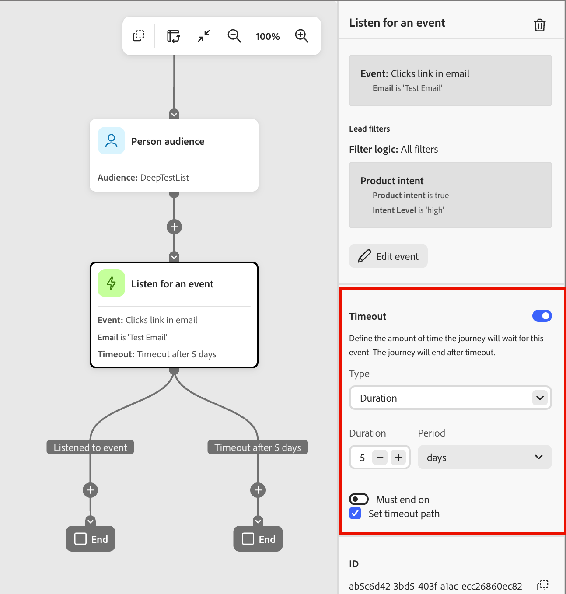

# Listen for an event node

To advance your audience to the next step in the journey when an event occurs, add the _Listen for an event_ node. 

## Event triggers {#event-triggers}

Define the event criteria that fire the journey node and move the audience member forward. 

<!--

Waiting for Steven to confirm what will be available for GA

| Triggers | Description |
| -------- | ----------- |
| Brand Concierge | |
| Email | |
| Event | |
| Opportunities | |
| Sales apps | |
| Other | |

--> 

>[!BEGINSHADEBOX]

**Supported Marketo Engage activities for triggers**

When triggering on events, [!DNL Marketo Optimizer] supports activities from the [!DNL Marketo Engage] instance that is connected as the data source. 

>[!NOTE]
>
>There can be only one [!DNL Marketo Engage] instance as the data source and it is preconfigured at time of provisioning of your [!DNL Marketo Optimizer] instance.

You can build event triggers around the following [!DNL Marketo Engage] activities:

* [!UICONTROL Fills out Marketo Engage form] - Fires when a lead submits a specified [!DNL Marketo Engage] form.
* [!UICONTROL Visits Marketo Engage web page] - Fires when a lead with a Munchkin tracking cookie visits a specified web page.
* [!UICONTROL Clicks link on Marketo Engage web page] - Fires when a lead clicks a tracked hyperlink on a web page that has the [!DNL Marketo Engage] Munchkin tracking code installed.
* [!UICONTROL Marketo Engage email is delivered] - Fires when a lead's mail server (MX) returns a success response (a 250 OK message) to the [!DNL Marketo Engage] sending server.
* [!UICONTROL Marketo Engage email bounces] - Fires when a target mail server rejects a sent [!DNL Marketo Engage] email message as a permanent error, such as an invalid user or unknown domain.
* [!UICONTROL Marketo Engage email bounces soft] - Fires when a target mail server rejects a sent [!DNL Marketo Engage] email message as a temporary issue (such as server busy or mailbox full). [!DNL Marketo Engage] automatically retries soft bounces up to three times through MX servers before flagging issues.
* [!UICONTROL Unsubscribes from Marketo Engage email] - Fires when a lead opts out of non-operational marketing emails. When triggered, [!DNL Marketo Engage] automatically updates the lead's `Unsubscribed` field value to `true`, suppressing them from future standard email sends.
* [!UICONTROL Opens Marketo Engage email] - Fires when a lead opens a tracked [!DNL Marketo Engage] email.
* [!UICONTROL Clicks link in Marketo Engage email] - Fires when a lead clicks any link (or a specific constrained link) inside a [!DNL Marketo Engage] email.

>[!ENDSHADEBOX]

## Event filters {#event-filters}

You can include filtering to limit matching event triggers based on various criteria:

| Filters | Description |
| ------- | ----------- |
| Activity history | Activities based on conditions that are evaluated using one or more selected items |
| Brand Concierge | |
| Company attributes | Attributes from the company/account profile, including: <li>Annual revenue <li>Company name <li>Billing country <li>Industry <li>Num employees <li>SIC code <li>State |
| Intent data | Attributes based on intent data associated with the person profile. |
| Opportunities | Attributes based on the opportunities associated with the person profile. |
| Person attributes | Attributes from the B2B person profile, including: <li>City <li>Country <li>Date of birth <li>Email address <li>Email invalid <li>Email suspended <li>First name <li>Inferred state region<li>Job title <li>Last name <li>Mobile phone number <li>Person engagement score <li>Phone number <li>Postal code <li>State <li>Unsubscribed <li>Unsubscribed reason |
| Sales apps | |
| Special filters | |

>[!BEGINSHADEBOX]

**Supported Marketo Engage activities for filters**

When filtering for triggered events, [!DNL Marketo Optimizer] supports activities from the [!DNL Marketo Engage] instance that is connected as the data source. 

>[!NOTE]
>
>There can be only one [!DNL Marketo Engage] instance as the data source and it is preconfigured at time of provisioning of your [!DNL Marketo Optimizer] instance.

You can build event filters around the following [!DNL Marketo Engage] activities:

* [!UICONTROL Filled Out Marketo Engage form] - Matches leads who have completed a specific [!DNL Marketo Engage] form at any point in their non-aged-out activity log.
* [!UICONTROL Visited Marketo Engage web page] - Matches leads who have viewed a specific URL on your website or [!DNL Marketo Engage] landing pages. It relies directly on the Munchkin tracking code installed on your site. 
* [!UICONTROL Clicked link on Marketo Engage web page] - Matches leads who have clicked a specific link or asset on a tracked page.
* [!UICONTROL Was sent Marketo Engage email] - Matches leads to whom [!DNL Marketo Engage] attempted to send a specific email, accounting for deployment actions prior to hard bounces or server acceptances.
* [!UICONTROL Was delivered Marketo Engage email] - Matches leads whose mail server (MX) returned a success response (a 250 OK message) to the [!DNL Marketo Engage] sending server.
* [!UICONTROL Marketo Engage email bounced] - Matches leads who experienced a hard bounce (permanent delivery failure) on a specific email send or within a timeframe.
* [!UICONTROL Marketo Engage email bounced soft] - Matches leads whose emails experienced a temporary delivery failure (such as a full inbox or an offline server) rather than a permanent hard bounce.
* [!UICONTROL Unsubscribed from Marketo Engage email] - Matches leads who opted out of non-operational marketing emails. When this occurs, [!DNL Marketo Engage] automatically updates the lead's `Unsubscribed` field value to `true`, suppressing them from future standard email sends.
* [!UICONTROL Opened Marketo Engage email] - Matches leads who opened a tracked [!DNL Marketo Engage] email.
* [!UICONTROL Clicked link in Marketo Engage email] - Matches leads who clicked any link (or a specific link) inside a [!DNL Marketo Engage] email.

>[!ENDSHADEBOX]

## Add an event node {#add-event-node}

1. Navigate to the journey canvas.

1. Click the plus ( **+** ) icon on a path and choose **[!UICONTROL Listen for an event]**.

   {width="200"}

1. In the node properties on the right, click **[!UICONTROL Add event criteria]**.

1. In the _[!UICONTROL Edit event]_ dialog, add an event and set the constraints that you want to match for the trigger.

   Drag and drop the event trigger into the builder space and set the definition. Click **[!UICONTROL Add constraint]** for each constraint that you want to use to refine the event match.

   {width="700" zoomable="yes"}

   You can add multiple events to match. The first qualifying event advances the person profile forward in the journey.

1. (Optional) Select the **[!UICONTROL Filters]** tab and add filtering criteria for the triggers.

   Drag and drop the filter into the builder space and set the definition. Click **[!UICONTROL Add constraint]** for each constraint that you want to use to refine the filter match.

   {width="700" zoomable="yes"}

1. Click **[!UICONTROL Save]**.

   At any point, you can click **[!UICONTROL Edit event]** to change the event criteria for the node.

1. If needed, set the **[!UICONTROL Timeout]** option to limit the time period to listen for the event.

   >[!NOTE]
   >
   >The journey ends after a timeout unless you define a timeout path, where you can add other nodes.

   Enable the **[!UICONTROL Timeout]** option and select the duration for which the journey waits for an event to occur before it times out.

   {width="550" zoomable="yes"}

   You can choose to end the path here or take a different action by setting another path. To create a new path in the journey where you can add actions and events applicable to accounts when the event does not occur, select the **[!UICONTROL Set timeout path]** check box.
