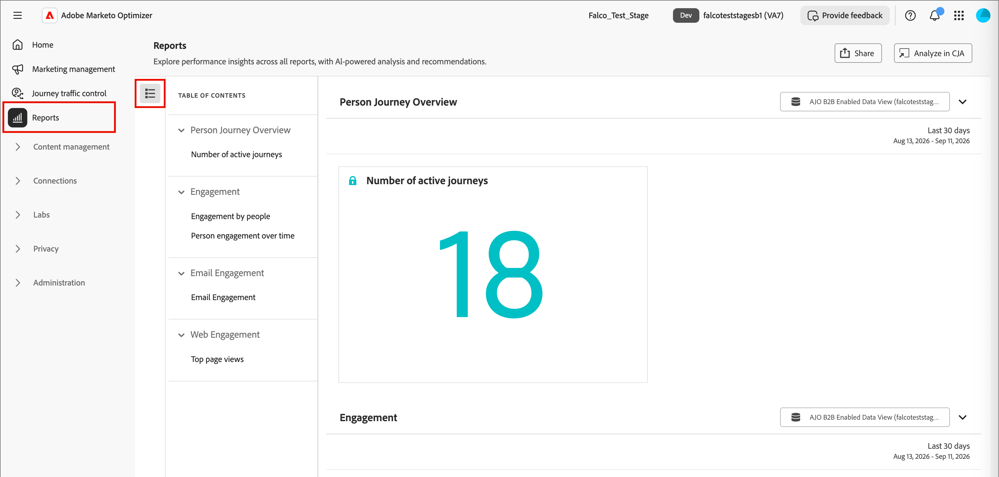

# Reports

The [!UICONTROL Reports] tab gives you performance insights across [!DNL Adobe Marketo Optimizer], including journey engagement, email performance, and web activity. On the left navigation, select **[!UICONTROL Reports]** to open it.

Each report is built on [!DNL Adobe Customer Journey Analytics] and embedded directly in [!DNL Marketo Optimizer]. Click the _List_ icon (  ) to use the **[!UICONTROL Table of contents]** panel on the left to jump between sections. 

{width="800" zoomable="yes"}

## Report sections {#report-sections}

The [!UICONTROL Reports] tab organizes pre-built reports into four sections. Each section has one or more downloadable items, and its own documentation page with details about its metrics and visualizations.

| Section | Downloadable items | Report page |
| --- | --- | --- |
| [!UICONTROL Person Journey Overview] | Number of active journeys | [Person Journey Overview report](./person-journey-overview-report.md) |
| [!UICONTROL Engagement] | Engagement by people, Person engagement over time | [Engagement report](./engagement-report.md) |
| [!UICONTROL Email Engagement] | Email Engagement | [Email Engagement report](./email-engagement-report.md) |
| [!UICONTROL Web Engagement] | Top page views | [Web Engagement report](./web-engagement-report.md) |

## Individual-record reports {#individual-record-reports}

Some reports focus on a single record instead of a section-wide view and are accessed from a different area in the application.

* For email send-time optimization performance, open the report from the [!UICONTROL Coworker] chat interface. For steps, see [Email send-time optimization](../marketing/email-send-time-optimization.md#reporting).
* For a person's progress through a single journey, open the report from within that journey.

## Export a report {#export-a-report}

Select **[!UICONTROL Share]** at the top of the report page to export or schedule delivery of its data.

{width="500"}

* **[!UICONTROL Download CSV]** - Export the report data as plain-text values.

* **[!UICONTROL Download PDF]** - Export all visible tables and visualizations in the report as a PDF file.

* **[!UICONTROL Schedule export]** - Set up a recurring export of the report, delivered weekly or monthly as a CSV or PDF file.

* **[!UICONTROL Manage schedules]** - Review and manage existing scheduled exports. The option shows a running count, such as `3/10`, of schedules used against your organization's limit.

>[!NOTE]
>
>Your organization can have a maximum of 10 scheduled exports across all reports, on a weekly or monthly frequency. If you are not an administrator, you can manage only your own scheduled exports. Administrators can view and manage every scheduled export in the organization.

## Analyze a report in CJA {#analyze-a-report-in-cja}

>[!AVAILABILITY]
>
>This function is available if your organization is licensed for [!DNL Adobe Customer Journey Analytics] and you are assigned the product profile.

Select **[!UICONTROL Analyze in CJA]** on any report section to open it in [!DNL Adobe Customer Journey Analytics] Workspace, where you can create custom visualizations in addition to what's available in the embedded report.

## Change the date range {#change-the-date-range}

Each report section shows data for a specific date range, displayed in the top-right corner of the section. Click in the date range fields to display the date selection tools and select the date range. You can choose a different preset or define a custom range.

{width="600"}
