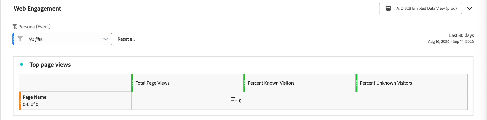

# Web Engagement report

<!-- SPHR-39571: Audience, Company Name, Company Industry, and Region filters, plus the report title/subtitle rename, are planned under SPHR-32471 (not yet shipped) and should be documented separately once delivered  -->

Use the [!UICONTROL Web Engagement] report to review the engagement for the top interactive webinars across your instance.

_To view the report:_

1. In the left navigation, select **[!UICONTROL Reports]**.
1. Click the _List_ icon (  ) and select **[!UICONTROL Web Engagement]** in the _[!UICONTROL Table of contents]_ panel.

{width="700" zoomable="yes"}

You can [change the date range](./reports-overview.md#change-the-date-range) for the report.

Select **[!UICONTROL Share]** at the top of the report to download or schedule an export of all report data. See [_Export a report_](./reports-overview.md#export-a-report) in the Reports overview.

## Report table {#report-table}

The [!UICONTROL Web Engagement] report shows the top 10 most-viewed pages in your instance, with the following row dimension.

* **[!UICONTROL Page Name]** - The name of the web page.

| Column | Description |
| --- | --- |
| [!UICONTROL Total Page Views] | Total number of views for the page. |
| [!UICONTROL Percent Known Visitors] | Percentage of views from known visitors. |
| [!UICONTROL Percent Unknown Visitors] | Percentage of views from unknown visitors. |

## Filters {#filters}

Use the following filter to narrow the report to a specific persona.

* **[!UICONTROL Persona]** - Filter by the persona associated with the page views.

>[!NOTE]
>
>Filters for audience, company name, company industry, and region are planned for a future release.
